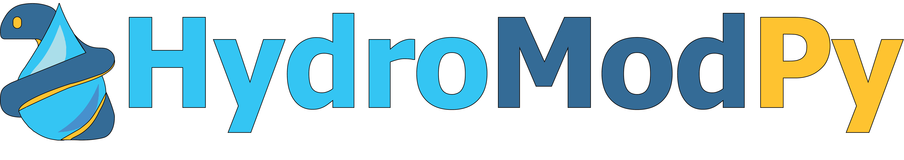

HydroModPy: A Python toolbox for deploying catchment-scale shallow groundwater models.

Stable current version: v0.1 [](https://hydromod.readthedocs.io/?badge=latest)

## Presentation

HydroModPy was initiated in 2018 to streamline the deployment of hydrological models in catchments across the crystalline basement regions of Normandy and Brittany, France. The platform integrates a wide range of open-source packages (FloPy, WhiteBoxTools, etc.), making them easily accessible and shareable among scientific communities. 
The development of HydroModPy was driven by two primary objectives.

First, it automates the extraction and discretization of watersheds from Digital Elevation Models (DEMs), while adding essential data available (e.g. piezometry, hydrography, geology) from local data to national and global databases. This ensures a standardized process for setting up and running simulation batches across different watersheds with uniform input data.

The second goal is to facilitate the visualization and comparison of results from the various modeling programs included within the platform. In addition to its scientific applications, HydroModPy also serves as a valuable educational tool, enabling students and researchers to explore hydrogeological modeling in a practical context.

## Authors

Alexandre Gauvain [1,2], Ronan Abhervé [1,3],  Alexandre Coche [1], Martin Le Mesnil [1], Clément Roques [3], Camille Bouchez [1],  Jean Marçais [4], Sarah Leray [5], Etienne Marti [5], Etienne Bresciani [8], Camille Vautier [1], Bastien Boivin [1], June Sallou [6], Johan Bourcier [7], Benoit Combemale [7], Philip Brunner [3], Laurent Longuevergne [1], Luc Aquilina [1], Jean-Raynald de Dreuzy [1]. 

- [1] Univ Rennes, CNRS, Geosciences Rennes — UMR 6118, Rennes, France
- [2] Laboratoire de Météorologie Dynamique (LMD), CNRS, Sorbonne Université, Paris, France
- [3] Centre for Hydrogeology and Geothermics (CHYN), Université de Neuchâtel, Neuchâtel, Switzerland
- [4] INRAE, UR RiverLy, Villeurbanne, France
- [5] Pontificia Universidad Católica de Chile, Santiago, Chile
- [6] INF, Wageningen University & Research, Wageningen, Netherlands 
- [7] Univ Rennes, Inria, CNRS, IRISA, Rennes, France
- [8] Instituto de Ciencias de la Ingeniería, Universidad de O’Higgins, Rancagua, Chile

## Links

- GitLab Project: https://gitlab.com/Alex-Gauvain/HydroModPy/
- Read the Docs: https://hydromod.readthedocs.io/
- Google Drive: https://docs.google.com/document/d/11BA4ufhYWbydBvfjQufohoPIc0SaF9pKcyj_KNJ2VQM/edit?usp=sharing
- Forum Group: https://groups.google.com/g/hydromodpy

## Git installation

Option 1 : Download the .zip folder directly on the GitLab project.

Option 2 : Clone a repository using a Git management tool like GitHub Desktop.

Option 3 : Use command line and classical Git functions to set up your work environment.

Info : Your local path directory should not contain any white space, to be compatible with MODFLOW-MODPATH suite.

## Environment installation

To install HydroModPy, Anaconda3 or Miniconda3 must be installed on your computer.
A HydroModPy environment can be installed with "conda" using the ".yml" file available in the "install" directory:

(0) Open Anaconda Prompt :
```
cd /d "path/where/is/the/install/directory/"
conda env create -f environment_windows.yml -n hydromodpy-0.1
```

## Launch HydroModPy

(1) Activate HydroModPy environment :
```
conda activate hydromodpy-0.1
```

(2) Open Spyder or Jupyter Notebook :
```
spyder
jupyter notebook
```

(3) Execute Python script following examples below :
```
 - 01_simplified example presentend in the paper
 - 02_basic features and overview of possibilities
 - 03_hydrographic network in steady state
 - 04_streamflow intermittence in transient
 - 05_piezometry in a heterogeneous coastal aquifer
 - 06_particle tracking for residence times
 - 07_recession analytical solution in 2D
```

## Linked publications

Papers published using HydroModPy.

Marti, E., Leray, S., & Roques, C. (2024). Catchment landforms predict groundwater-dependent wetland sensitivity to recharge changes. Hydrology and Earth System Sciences Discussions. https://doi.org/10.5194/HESS-2024-381

Floriancic, M. G., Abhervé, R., Bouchez, C., Martinez, J. J., & Roques, C. (2024). Evidence of Groundwater Seepage and Mixing at the Vicinity of a Knickpoint in a Mountain Stream. Geophysical Research Letters, 51. https://doi.org/10.1029/2024GL111325

Le Mesnil, M., Gauvain, A., Gresselin, F., Aquilina, L., & Dreuzy, J. De. (2024). Characterizing coastal aquifer heterogeneity from a single piezometer head chronicle. Journal of Hydrology, 131859. https://doi.org/10.1016/j.jhydrol.2024.131859

Abhervé, R., Roques, C., De Dreuzy, J.-R., Datry, T., Brunner, P., Longuevergne, L., & Aquilina, L. (2024). Improving calibration of groundwater flow models using headwater streamflow intermittence. Hydrological Processes, 38((6)). https://doi.org/10.1002/hyp.15167

Abhervé, R., Roques, C., Gauvain, A., Longuevergne, L., Louaisil, S., Aquilina, L., & de Dreuzy, J.-R. (2023). Calibration of groundwater seepage against the spatial distribution of the stream network to assess catchment-scale hydraulic properties. Hydrology and Earth System Sciences, 27(17), 3221–3239. https://doi.org/10.5194/hess-27-3221-2023

## Coresponding authors

For any questions regarding HydroModPy, please contact us at <alexandre.gauvain.ag@gmail.com> or <ronan.abherve@gmail.com>

## Abstract for the congress IAH 2024

The need for predictive models increases as the pressure of global change intensifies. Regional-scale modeling of shallow unconfined aquifers (10-100 m depth) remains challenging, especially in complex basement aquifers. Controlled both by topography and geology, groundwater flows are organized from hillslope to catchment scale. It is particularly the case in crystalline regions with low aquifer volumes and wet climates, resulting in significant subsurface-surface interactions with very few information available to constrain models.

To address this, we present HydroModPy, an application developed in Python as a toolbox for automatic deployment of groundwater flow models. HydroModPy integrates geospatial processing (WhiteBoxTools) with groundwater flow and transport simulation tools (MODFLOW and MODPATH via FloPy). It is designed to call other groundwater flow solvers, facilitate multi-site deployment, integrate pre- and post-processing functions such as catchment extraction from a DEM and an advanced representation of head and flow results. Emphasis is placed on integrating aquifer geometry complexities and hydraulic properties heterogeneity (compartmentalization, exponential decay, implementation of a 3D geological model, etc.).

HydroModPy's user-friendly Python interface allows for testing and exploring various aquifer models across different geomorphological contexts and recharge conditions. Ongoing improvements include methods for calibrating and estimating hydraulic properties using multiple datasets such as hydrographic network maps, streamflow, and piezometric level data. HydroModPy is developed as an open-source toolkit. It is currently being used in climate change effects on groundwater-dependent ecosystems and water resource management issues. Collaborative development should enhance the modeling capacity of near-surface aquifers, facilitate their extension to the regional scale for predictive purposes.

## How to cite

A paper about HydroModPy is in preparation for the journal Hydrology and Earth System Sciences.

Gauvain, A., Abhervé, R., Coche, A., Le Mesnil, M., Roques, C., Bouchez, C., Marçais, J., Leray, S., Marti, E., Bresciani, E., Vautier, C., Boivin, B., Sallou, J.,  Bourcier, J., Combemale, B., Longuevergne, L., Aquilina, L., and de Dreuzy, J.-R. (2025). HydroModPy: A Python toolbox for deploying catchment-scale shallow groundwater models. In preparation for Hydrology and Earth System Sciences.
