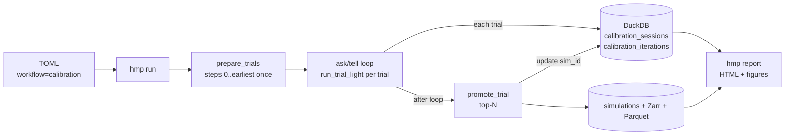
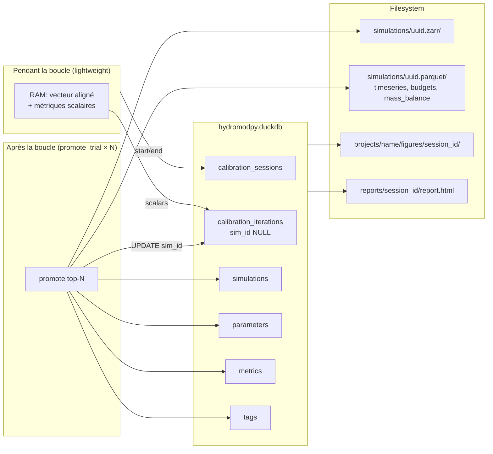

# Guide de calibration

Public : hydrogéologues, modélisateurs et développeurs HydroModPy
souhaitant calibrer les paramètres d'un modèle d'eau souterraine à
l'échelle du bassin versant. Ordre de lecture conseillé : §1 (principes),
§2 (workflow), §3 (TOML), §7 (lecture des résultats). Les sections §4 à
§9 sont de la référence à consulter une fois la boucle en route.

Ce guide est la source unique de vérité pour le sous-système de
calibration dans la branche `dev-database`. Code : `hydromodpy/calibration/`.

Liens : [glossary.md](glossary.md),
[design_patterns.md](design_patterns.md),
[simulation_catalog_architecture.md](simulation_catalog_architecture.md),
[CLI.md](CLI.md).

---

## Vue d'ensemble

Une calibration HydroModPy est une boucle ask/tell qui ajuste
itérativement quelques paramètres du modèle (conductivité hydraulique
`K`, porosité efficace `Sy`, conductance de drainage) afin que la sortie
simulée s'approche au mieux d'une série de référence (débit à une
station, charge à un piézomètre). La boucle est pilotée par un
optimiseur qui propose des valeurs et réagit à un objectif scalaire
(NSE, KGE, RMSE) calculé à chaque trial.

Par rapport à un `hmp run` simple, une calibration :

- produit une trace de N évaluations (une ligne par trial dans le
  catalogue DuckDB), pas une simulation unique ;
- réutilise les étapes coûteuses de setup (géographie, maillage,
  chargement de données) entre trials via la primitive
  `prepare-once-evaluate-many` ;
- n'écrit sur disque que les meilleurs runs sous forme de simulations
  Zarr et Parquet complètes. Les autres trials restent sous forme de
  lignes légères dans DuckDB ;
- peut être reprise entre sessions grâce au cache adressé par contenu
  `params_hash`.

Utiliser une calibration pour ajuster un modèle à des observations.
Utiliser un `hmp run` simple si les paramètres sont déjà connus.

Termes précis employés dans ce guide :

- `TrialContext` : runtime préparé, réutilisé par chaque trial d'une
  session (§2, §4).
- `earliest_affected_step` : entier qui décide quelles étapes du
  pipeline sont skippées par trial (§4).
- `params_hash` : fingerprint SHA-256 utilisé pour le cache inter-session
  (§8).
- `promote_trial` : action qui transforme une ligne trial légère en
  simulation Zarr et Parquet complète (§2, §5).

---

## Workflow de bout en bout



Node by node:

- **TOML**: a regular HydroModPy project TOML extended with a
  `[calibration]` section and a top-level `workflow = "calibration"`
  marker. The rest of the file (`[simulation]`, `[flow]`, `[data]`,
  `[solver]`) is exactly what you would write for a single run.
- **`hmp run`**: the unified CLI entry point. It reads `workflow =
  "calibration"` and dispatches to
  `hydromodpy.calibration.runner.run_calibration_cli`. There is no
  separate `hmp calibrate` command.
- **`prepare_trials`**: runs pipeline steps `[0..earliest)` exactly
  once. `earliest` is computed from the dotted paths declared by
  `[calibration.parameters.*]` (see §4). The prepared
  `WorkflowContext` (geographic, mesh, loaded forcings) is held in
  RAM and forked by every trial.
- **Ask/tell loop**: the optimizer proposes a parameter point, the
  loop forks the prepared context, injects the values, runs steps
  `[earliest..8]` in **lightweight** mode (no disk writes beyond the
  solver's own scratch files), extracts the scalar objective from RAM,
  and tells the optimizer. Repeat up to `max_iter`.
- **DuckDB**: every trial adds one row to `calibration_iterations`
  (`sim_id` stays `NULL`). The session metadata lives in one row of
  `calibration_sessions` that is finalized at the end.
- **`promote_trial` (top-N)**: if `save_runs != "none"`, the chosen
  trials are replayed through the *full* pipeline (steps `00..11`) by
  `hydromodpy.Project(cfg_path).run(**values)`. Each promotion creates
  a Zarr store, a Parquet directory, and a `simulations` row, and
  back-fills the corresponding `calibration_iterations.sim_id`.
- **`hmp report <session_id>`**: post-processing CLI that reads the
  session + iterations from DuckDB, renders the six calibration
  figures, and emits a standalone HTML report at
  `<workspace>/reports/<session_id>/report.html`.

---

## Le TOML côté utilisateur

Cette section s'appuie sur l'exemple canonique livré avec le dépôt :
`examples/projects/02_nancon_watershed/run_calibration_k.toml`. Les
extraits ci-dessous en sont copiés verbatim.

### Overlay et marqueur de workflow

```toml
base_config = "project.toml"

workflow = "calibration"
```

- `base_config`: relative path to the *base* project TOML
  (`project.toml` here). All sections of the base are inherited and
  overridden by the current file. This is how you keep a single
  description of the catchment shared between simulation, calibration,
  and sweep overlays.
- `workflow = "calibration"`: the single switch that tells `hmp run`
  to dispatch to the ask/tell loop instead of the default
  single-simulation path. Dispatch logic lives in
  `hydromodpy/cli/workflows.py:DISPATCH`.

### Bloc simulation (standard)

```toml
[simulation]
name = "nancon_calibration_k"
description = "Calibration Optuna de K sur NSE(discharge), Sy/Ss fixés."

[simulation.time]
start_datetime = "2000-01-01"
end_datetime = "2002-12-31"
step_value = "1 month"
coverage_policy = "warn"

[[simulation.process]]
id = "flow_main"
type = "flow"
solvers = ["modflownwt"]
```

The `[simulation]` tree is exactly what you write for a single `hmp
run`: a name, a time window, and one or more processes. **Changing the
solver does not change anything in the `[calibration]` section**: the
calibration code is solver-agnostic (no `modflow`, `modflow6`,
`boussinesq`, or `solver_engine` string appears anywhere in
`hydromodpy/calibration/`). Swap `"modflownwt"` for `"modflow6"` and
the same TOML calibrates the other solver (subject to the metric
extractor coverage noted in §6).

### Paramètres figés

```toml
[domain.depth_model]
thickness = 30.0

[flow.param.Sy.field_homogeneous]
value = 0.05

[flow.param.Ss.field_homogeneous]
value = 1e-5

[flow.sinks_sources.recharge]
first_clim = "first"
```

Any leaf not listed under `[calibration.parameters.*]` is **frozen**
at the value written in the TOML. Here `Sy` and `Ss` are frozen at
`0.05` and `1e-5`; only `K` is calibrated.

### La section `[calibration]`

```toml
[calibration]
method = "grid"
max_iter = 40
batch_size = 1
save_runs = "best_n"
save_best_n = 5
seed = 42
objective = "nse"
variable = "discharge"
use_cache = true
```

Exhaustive option reference:

| Option | Values | Default | Effect |
|---|---|---|---|
| `method` | `grid` / `random_search` / `optuna` / `scipy_de` / `scipy_nelder_mead` | `grid` | Sampler backing the ask/tell loop. `optuna` and `cma_es` require the calibration extra. |
| `max_iter` | integer ≥ 1 | `100` | Maximum number of trial evaluations. |
| `save_runs` | `none` / `best_n` / `all` | `none` | How many trials to promote to full simulations after the loop. |
| `save_best_n` | integer ≥ 0 | `10` | Number of top trials promoted when `save_runs = "best_n"`. **Ignored** when `save_runs != "best_n"`. |
| `objective` | `nse` / `kge` / `rmse` / `"module.path:fn"` | `nse` | Scalar metric; the string form is the Python escape hatch (§10). |
| `variable` | `discharge` / `head` | `head` | Observed variable to compare against. `"discharge"` reads from `[data.hydrometry]`; `"head"` from `[data.piezometry]`. |
| `seed` | integer or `null` | `null` | Random seed for reproducibility. `null` = non-reproducible. |
| `use_cache` | bool | `true` | Enable the `params_hash` cross-session cache (§8). |
| `batch_size` | integer ≥ 1 | `1` | Suggestions drawn per `ask`. Reserved for future parallel trials. Leave at `1` today. |
| `optimizer_kwargs` | dict | `{}` | Extra kwargs forwarded to the sampler (e.g. `{sampler = "cmaes"}` for Optuna). |

### Déclarations par paramètre

```toml
[calibration.parameters.K]
bounds = [1e-6, 1e-3]
transform = "log"
prior = "log_uniform"
path = "flow.param.K.value"
units = "m/s"
```

Exhaustive option reference for each `[calibration.parameters.<name>]`
block:

| Option | Values | Required | Effect |
|---|---|---|---|
| `bounds` | `[low, high]` | yes (except some grid/fixed-space setups) | Physical bounds. For `optuna` / `scipy_de` / `grid` these are the sampling bounds. |
| `transform` | `identity` / `log` / `logit` | no (defaults to `identity`) | Internal sampling space. Use `log` for strictly-positive quantities spanning several orders of magnitude (K, conductances, storage). |
| `prior` | `uniform` / `log_uniform` / `normal` | no (defaults to `uniform`) | Prior used by Bayesian samplers (`gp_mapping`, `da_mh_gp`). Non-Bayesian methods ignore this. |
| `path` | dotted path | yes | Where to inject the value in `HydroModPyConfig` each trial (see §4). |
| `units` | free string | no | Informational label used in figures and reports. |

Example recipes for common parameter shapes:

```toml
# Homogeneous K
[calibration.parameters.K]
bounds = [1e-6, 1e-3]
transform = "log"
path = "flow.param.K.value"

# Zoned K: one block per zone, each with its own `path`
[calibration.parameters.K_granite]
bounds = [1e-6, 1e-3]
transform = "log"
path = "flow.param.K.field_spatial.zone_granite.value"

[calibration.parameters.K_schiste]
bounds = [1e-6, 1e-3]
transform = "log"
path = "flow.param.K.field_spatial.zone_schiste.value"

# Specific yield (no log: already O(1))
[calibration.parameters.Sy]
bounds = [0.02, 0.30]
transform = "identity"
path = "flow.param.Sy.field_homogeneous.value"

# Drain conductance
[calibration.parameters.drain_cond]
bounds = [1e-4, 1e-1]
transform = "log"
path = "flow.sinks_sources.stream_drain.conductance"

# Aquifer thickness
[calibration.parameters.thickness]
bounds = [10.0, 80.0]
transform = "identity"
path = "domain.depth_model.thickness"
```

### Aide-mémoire recettes

| Use case | Block |
|---|---|
| Quick exploratory sweep (1-2 params) | `method = "grid"`, `max_iter ≈ 25`, `save_runs = "none"` |
| Default production calibration | `method = "grid"`, `max_iter = 100`, `save_runs = "best_n"`, `save_best_n = 5`, `seed = 42` |
| Multi-dim continuous (3+ params) | `method = "optuna"`, `optimizer_kwargs = {sampler = "cmaes"}`, `max_iter = 300` |
| Local refinement near a known optimum | `method = "scipy_nelder_mead"`, `max_iter = 80` |
| Full Bayesian posterior (Phase 4) | `method = "da_mh_gp"`, `max_iter = 2000`, `save_runs = "best_n"`, `save_best_n = 10` |

---

## Invalidation automatique d'étapes

Every pipeline step declares which TOML subtrees it reads via a
`config_sections` class variable. When a calibration mutates
`flow.param.K.value`, only the steps that consume `flow.*` (and their
downstream siblings) need to re-run. The earlier steps produce the
same result on every trial and are executed exactly once inside
`prepare_trials`.

```mermaid
flowchart TB
    subgraph "Pipeline steps (00-11)"
        S00[00 Validate<br/>workspace, simulation]
        S01[01 Resolve<br/>workspace, simulation]
        S02[02 LoadData<br/>data]
        S03[03 BuildGeographic<br/>geographic, data.dem]
        S04[04 BuildMesh<br/>domain.supports]
        S05[05 SetupProcess<br/>domain.depth_model, flow.ic]
        S06[06 PrepareSolver<br/>flow, transport, solver]
        S07[07 RunSolver<br/>flow, transport, solver]
        S08[08 Extract]
        S09[09 Derive<br/>postprocess]
        S10[10 Export]
        S11[11 Display<br/>display]
    end

    S00 --> S01 --> S02 --> S03 --> S04 --> S05
    S05 --> S06 --> S07 --> S08 --> S09 --> S10 --> S11

    classDef shared fill:#d4f1d4,stroke:#333
    classDef looped fill:#ffe4b5,stroke:#333
    classDef promoted fill:#c5e1f5,stroke:#333

    class S00,S01,S02,S03,S04,S05 shared
    class S06,S07,S08 looped
    class S09,S10,S11 promoted
```



- **Green (shared)**: steps `00..05`. Executed once by
  `prepare_trials`. Geographic, mesh, and loaded forcings live in
  `TrialContext.ctx` and are shared by reference across every fork.
- **Orange (looped)**: steps `06..08`. Re-run per trial in
  `run_trial_light`. The trial fork deep-copies the config, injects
  the new parameter values, and re-executes this slice only.
- **Blue (promoted)**: steps `09..11`. Never run during the
  calibration loop. Executed only for the trials picked up by
  `promote_trial` after the loop converges.

### Si je calibre X, qu'est-ce qui est rejoué ?

| Calibrated path | `earliest` | Steps shared (run once) | Steps re-run per trial | Rough speedup |
|---|---|---|---|---|
| `flow.param.K.value` | 6 | 00-05 | 06-08 | ~3× |
| `flow.param.K.field_homogeneous.value` | 6 | 00-05 | 06-08 | ~3× |
| `flow.param.Sy.field_homogeneous.value` | 6 | 00-05 | 06-08 | ~3× |
| `flow.param.K.field_spatial.zone_granite.value` | 6 | 00-05 | 06-08 | ~3× |
| `flow.sinks_sources.stream_drain.conductance` | 6 | 00-05 | 06-08 | ~3× |
| `domain.depth_model.thickness` | 5 | 00-04 | 05-08 | ~2× |
| `domain.supports.cell_size` | 4 | 00-03 | 04-08 | ~1.7× |
| `geographic.buff_area` | 3 | 00-02 | 03-08 | ~1.3× |

**Matching rule: dotted longest-prefix.** Given an override path like
`flow.param.K.field_homogeneous.value`, the selector walks each step's
`config_sections` and accepts a match when the section is a
dotted-prefix of the path. `flow` matches, `flow.param.K` matches,
`flow.param.K.value` matches, but `flow_runtime` does not. The lowest
index among matching steps wins; everything downstream of it is forced
to re-run even if its own sections did not match (step 08 Extract, for
instance, has empty `config_sections`, yet it re-runs because it
consumes the state produced by step 07).

Implementation: `hydromodpy/pipeline/dependencies.py:earliest_affected_step`.
Per-step annotations: `config_sections: ClassVar[tuple[str, ...]]` on
each of the 12 `step_<nn>_*.py` modules.

---

## Stockage



Rule of thumb: **RAM inside the loop, DuckDB for the trace, Zarr /
Parquet only for promoted runs.**

| Artefact | Lives in | Written when |
|---|---|---|
| Simulated vector aligned on observations | RAM only | Each `run_trial_light`: discarded at end of trial |
| Per-station scalar metrics (NSE, KGE, RMSE) | `calibration_iterations.metrics` (JSON column) | After each trial |
| Session metadata | `calibration_sessions` (1 row / session) | Start + finalize |
| Parameters + scalar objective | `calibration_iterations` (sim_id NULL by default) | After each trial |
| `params_hash` | Column in `calibration_iterations` | After each trial |
| Spatial fields `head(x, y, t)` | `simulations/<sim_id>.zarr/` | **Only** via `promote_trial` |
| Detailed timeseries (head, Q) | `simulations/<sim_id>.parquet/timeseries.parquet` | **Only** via `promote_trial` |
| Figures (PNG) | `<workspace>/projects/<name>/figures/<session_id>/` | Post-loop via Display registry |
| HTML report | `<workspace>/reports/<session_id>/report.html` | `hmp report <session_id>` |

Disk-space cheat-sheet for a representative 100-trial session on a
moderately fine mesh:

| `save_runs` | DuckDB | Zarr dirs | Parquet dirs | Typical total |
|---|---|---|---|---|
| `none` | 100 iter + 1 session | 0 | 0 | ~500 KB |
| `best_n = 5` | 100 iter + 5 sim + 5 param + 5 metric + 1 session | 5 | 5 | ~2.5 GB |
| `all` | 100 iter + 100 sim + … | 100 | 100 | ~50 GB |

**Recommendation.** Use `save_runs = "best_n"` as your default. It
keeps the full trace queryable in DuckDB while only materializing the
trials you might actually inspect later. Use `"all"` only for
short diagnostic calibrations (≤ 20 trials) when you want every single
run on disk.

---

## Méthodes d'optimisation

| Method | Type | Typical budget | Deterministic | Strength | When to pick it |
|---|---|---|---|---|---|
| `grid` | Enumeration | Product of `n_points` | Yes | Simple, exhaustive | 1-2 params, unlimited budget |
| `optuna` (default TPE) | Light Bayesian | 50-200 | Seed-dependent | Adaptive, easy | Sensible default |
| `optuna` (`sampler="cmaes"`) | Evolutionary | 100-500 | Seed-dependent | Continuous multi-dim | 3+ continuous params |
| `scipy_de` | Evolutionary | 100-500 | Seed-dependent | Robust | Alternative to Optuna CMA-ES |
| `scipy_nelder_mead` | Local simplex | 50-100 | Partially | Fast local | Refine around a known optimum |
| `gp_mapping` (Phase 4) | GP surrogate + EI | 30-100 | Seed-dependent | Few expensive evaluations | Slow solvers |
| `da_mh_gp` (Phase 4) | MCMC + GP surrogate | 1000+ | No | Full posterior | Uncertainty quantification |

`optimizer_kwargs` hints:

- **`grid`**: `{ "n_points": {K = 10, Sy = 5} }` to set per-parameter
  granularity. Defaults to a uniform count across all parameters.
- **`optuna`**: `{ "sampler": "tpe" | "cmaes" | "random", "pruner": "median" }`.
  Default sampler is TPE; `cmaes` is strongly recommended when you
  have 3+ continuous parameters.
- **`scipy_de`**: `{ "popsize": 15, "mutation": [0.5, 1.0], "recombination": 0.7 }`
 : the standard `scipy.optimize.differential_evolution` knobs.
- **`scipy_nelder_mead`**: `{ "xatol": 1e-4, "fatol": 1e-4, "adaptive": true }`.
  `adaptive = true` is friendlier in higher dimensions.
- **`gp_mapping`**: `{ "n_initial": 10, "acq": "ei" }`: expected
  improvement over an RBF Gaussian Process surrogate.
- **`da_mh_gp`**: `{ "burn_in": 200, "thin": 5, "proposal_scale": 0.3 }` :
  Metropolis-Hastings tuned by the surrogate.

---

## Lire les résultats

### a) API Python et DuckDB

```python
import hydromodpy as hmp

catalog = hmp.open("~/workspace")
sessions = catalog.calibration_sessions()
iters = catalog.calibration_iterations(session_id=sessions.iloc[0]["session_id"])
best = catalog.best(project="calibration", metric="nse")
best.plot("watertable_map", save="~/figures/")
print(iters.head())
```

- `catalog.calibration_sessions()` returns a `DataFrame` with one row
  per session (method, objective, best_objective, duration_s, …).
- `catalog.calibration_iterations(session_id=...)` returns the full
  per-trial trace (parameters, objective_value, status, sim_id,
  params_hash).
- `catalog.best(project, metric)` gives you a `Run` object for the
  best promoted trial across sessions matching `project`.

### b) Figures via le registre display

Six named figures ship with HydroModPy. Each implements the `Figure`
protocol and is registered in `hydromodpy/display/figures/__init__.py`.

- `calibration_convergence`: best-so-far objective vs iteration.
- `calibration_trace`: parallel plots of every parameter + objective
  across iterations.
- `calibration_landscape`: 2D scatter of any pair of parameters
  coloured by objective value.
- `calibration_posterior`: marginal histograms per parameter.
- `calibration_objective_surface`: interpolated NSE surface over any
  2-parameter slice.
- `calibration_pairplot`: pairwise grid of scatter + histograms.

Render one figure at a time from the CLI (the session id is printed
on stderr during `hmp run`):

```bash
hmp display run_calibration_k.toml --session <session_id> --figure calibration_convergence
hmp display run_calibration_k.toml --session <session_id> --figure calibration_trace
hmp display run_calibration_k.toml --session <session_id> --figure calibration_landscape
hmp display run_calibration_k.toml --session <session_id> --figure calibration_posterior
hmp display run_calibration_k.toml --session <session_id> --figure calibration_objective_surface
hmp display run_calibration_k.toml --session <session_id> --figure calibration_pairplot
```

Pre-rendered examples for a Dupuit / MODFLOW-6 twin benchmark live
under
`docs/readthedocs/source/_static/capability_gallery/calibration/` :
reuse them as visual references.

You can also ask the loop to render figures automatically at the end
of the session by listing them under `[display] figures = [...]` in
the TOML.

### c) Rapport HTML

For users who do not want to drop into Python:

```bash
hmp report <session_id>
xdg-open ~/workspace/reports/<session_id>/report.html
```

The report embeds the six figures together with a summary table
(method, objective, best parameters, best_sim_id, duration). It is
fully standalone: the HTML file + its sibling PNGs can be shipped as
a single folder.

---

## Cache cross-session et reproductibilité

Every trial is fingerprinted by a `params_hash`: the SHA-256 of its
canonical parameter JSON representation (keys sorted, floats
normalized). The hash is written on every `calibration_iterations`
row.

- `use_cache = true` (default): before running a trial, the engine
  looks up `params_hash` in the `ParamsHashCache`. The cache is
  preloaded at session start from every *completed* and *promoted*
  iteration of every previous session on the same workspace. If a hit
  is found, the sim_id is reused and the solver is skipped entirely :
  the cached objective value is returned.
- `seed = 42`: seeds the sampler. Combined with a deterministic
  solver, this makes the whole sequence reproducible. Leave `null`
  for stochastic exploration.

Disable the cache (`use_cache = false`) when:

- your input data changed (new forcings, new DEM, new observations);
- the solver version changed;
- you want to benchmark true per-trial wall time.

---

## Pièges fréquents et comment les éviter

- **`path` pointe vers un champ inexistant.** The engine raises a
  `CalibrationSetupError` with the list of valid paths. Double-check
  with `hmp doctor --toml run_calibration_k.toml`.
- **Bornes trop serrées.** The optimizer converges on a plateau and
  reports a false "best". Widen `bounds` and re-run.
- **`transform = "identity"` sur K de 1e-6 à 1e-3.** Uniform sampling
  in the physical space burns 99 % of the budget on the top decade.
  Always `transform = "log"` for multi-order quantities (K,
  conductances, storage coefficients).
- **`save_runs = "all"` sur 100 trials.** You end up with ~50 GB of
  Zarr. Use `best_n` unless you really want every trial on disk.
- **`max_iter` trop faible pour une méthode bayésienne.** Optuna TPE
  needs at least ~50 trials to start exploiting; `da_mh_gp` needs a
  few hundred before the posterior stabilizes.
- **Variable `"discharge"` mais aucune hydrométrie dans `[data]`.** The
  metric extractor returns `NaN` on every trial; the session completes
  in seconds with no usable output. Check that `[data.hydrometry]` (or
  `[data.piezometry]` for head) is populated.
- **MODFLOW-6 + calibration de discharge.** The extractor in
  `hydromodpy.calibration.metrics` currently covers MODFLOW-NWT only;
  MODFLOW-6 returns `NaN`. Scheduled as future work: use
  MODFLOW-NWT in the meantime or plug in a custom extractor via §10.
- **Oublier `workflow = "calibration"`.** `hmp run` then treats the
  TOML as a simulation and runs `K` exactly once with its default
  value. The `[calibration]` section is ignored silently.

---

## Référence API Python

Programmatic entry point (no CLI needed):

```python
from hydromodpy.calibration.runner import run_calibration_cli

summary = run_calibration_cli(
    "run_calibration_k.toml",
    objective="mypkg.metrics:custom_nse",
    workspace="~/workspace",
    project="nancon_K",
)
print(summary["best_sim_id"], summary["best_objective"])
```

- The positional argument is the TOML path; it is resolved relative to
  the current working directory.
- `objective="module.path:fn"` is the Python escape hatch. The
  callable must match the `TrialMetricFn` signature
  `(ctx, *, objective, variable) -> (primary_metric, {component: value})`.
  Use it when the default NSE / KGE / RMSE extractor does not fit your
  variable (multi-station weighted, filtered seasons, …).
- `workspace` overrides the workspace root resolved from the TOML
  (same rule as the binary resolver in `WorkspaceConfig`).
- `project` is a free string written to `calibration_sessions.project`.

The return dict keys are:

```
session_id, method, n_iterations, best_objective,
best_sim_id, duration_s, save_runs, promoted
```

### Briques bas niveau

The CLI is a thin wrapper around three primitives you can call
directly for custom orchestration:

```python
from hydromodpy.simulation.execution.trial import (
    prepare_trials, run_trial_light, promote_trial,
)

trial_ctx = prepare_trials(
    "run_calibration_k.toml",
    override_paths={"K": "flow.param.K.value"},
)
result = run_trial_light(
    trial_ctx, {"K": 1e-4},
    objective="nse", variable="discharge",
)
if result.status == "completed":
    sim_id = promote_trial(
        "run_calibration_k.toml",
        {"K": 1e-4},
        paths={"K": "flow.param.K.value"},
        name="manual_k_1e-4",
    )
```

Useful diagnostics on a persisted trace:

```python
from hydromodpy.calibration.diagnostics import (
    convergence_rate, parameter_correlation,
)

rate = convergence_rate(iters)
print(rate["slope"], rate["r_squared"])
corr = parameter_correlation(iters, parameters=["K", "Sy"])
print(corr)
```

Render a specific figure programmatically (equivalent to the `hmp
display` call in §7b):

```python
from pathlib import Path
import hydromodpy as hmp

catalog = hmp.open("~/workspace")
fig = hmp.display.get("calibration_convergence").plot(
    session_id="abcd1234ef...",
    catalog=catalog,
    save_path=Path("~/figures/convergence.png").expanduser(),
)
```

### Cas de test analytiques

Two pure-Python demos are shipped for local experimentation (no
MODFLOW install needed):

- `hydromodpy.calibration.cases.recession_brutsaert`: hydrograph
  recession fit (`Q(t) = Q0 * exp(-t/tau)`) used as the golden for
  `grid_search`, `random_search`, `nelder_mead`, `simplex`, `cma_es`,
  `gp_mapping`, `da_mh_gp`.
- `hydromodpy.calibration.cases.groundwater_1d`: 1D synthetic
  aquifer with analytical head profile.

They are the quickest way to check that a new optimizer adapter
behaves against the known-good `METHOD_ABS_TOL` tolerances.
