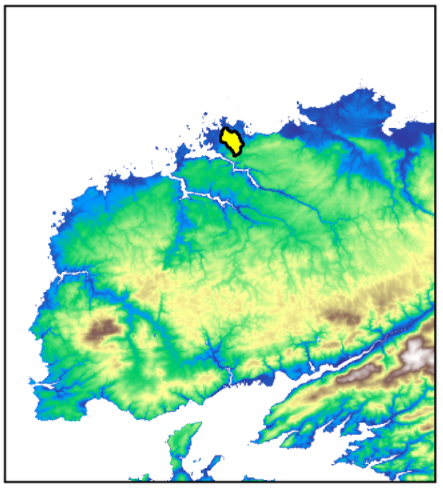
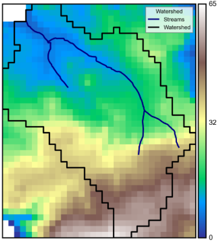
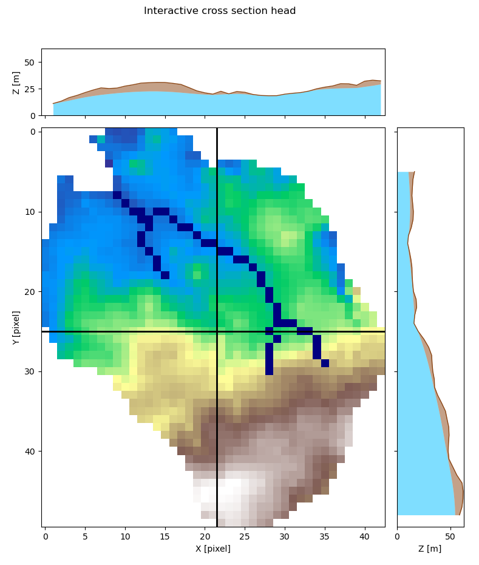
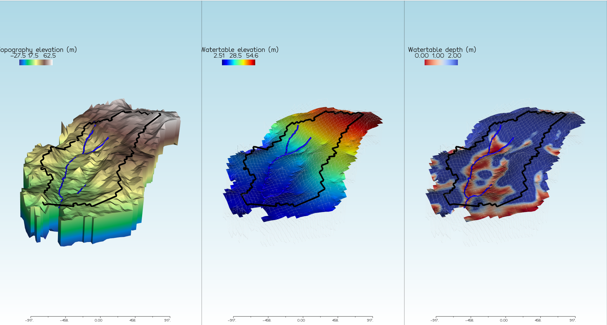
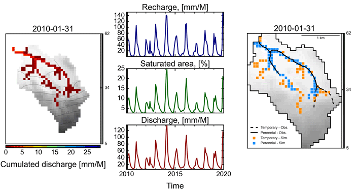

Examples
========

.. nbgallery::
    example_02

Import Modules
**************
.. code-block:: python

	# Modules
	import os
	import pandas as pd
	from osgeo import gdal, osr
	from IPython import get_ipython
	get_ipython().run_line_magic('matplotlib', 'inline')
	import matplotlib.pyplot as plt
	import imageio
	                 
	# HydroModPy Modules
	from watershed import watershed_root, watershed_display
	from tools import to_plot, vtk
	from groundwater_flow import plots

Configuration Path
******************
.. code-block:: python

	# Path to the git repositoty home page
	DIR = dirname(dirname(str(pathlib.Path().resolve())))
	git_path =os.path.join(DIR,"CORE_COMM")
	# Path to the test folder
	test_path = os.path.join(git_path,"examples","_example")
	# Path where the results will be stored
	out_path = os.path.join(test_path,"readthedocs", "out")

	# We suggest to store the data in specific folder
	dems_path = os.path.join(test_path,'dem')
	hydrology_path = os.path.join(test_path,'hydrology') # add hydrographic shapefiles
	modflow_path = os.path.join(test_path,'modflow') # add bin/ folder with necessary .exe
	climate_path = os.path.join(test_path,'climate')
	piezometry_path = None # add piezometry data or nothing for automatic download
	geology_path = None # add geologic layers
	oceanic_path = None # add specific sea level files
	# Specifically designed to process SURFEX data (France scale)
	surfex_path =  None # add surfex models in .h5 format

	# Indicate the name of the regional DEM
	dem_name = "DEM_test_75m_LAMB93.tif"
	# dem_name = "DEM_bzh_75m_LAMB93.tif"
	dem_path = os.path.join(dems_path,dem_name)

	dem = gdal.Open(dem_path)
	proj = osr.SpatialReference(wkt=dem.GetProjection())
	crs = int(proj.GetAttrValue('AUTHORITY',1))

	# Import the library of watersheds to generate
	library_path = os.path.join(test_path,'watershed_library.csv') # each row is a study site
	library = pd.read_csv(library_path, sep=';', header=0, engine='python') # explore catchment studied

	# Select from the library the interest catchment
	watershed_name = 'Watershed' # add manually study site information in map units
	mysite = library[library['watershed_name'] == watershed_name] # specific row

	# Paths generated automatically but necessary for plots
	stable_folder = os.path.join(out_path,watershed_name,'results_stable')
	simulations_folder = os.path.join(out_path,watershed_name,'results_simulations')

	# Specify the hydrologic layers to clip
	types_obs = ['streams','sections'] # list of shapefile name layers
	fields_obs = ['FID','Persistanc'] # list of shapefile name columns to translate in a tif

Build Watershed Object
**********************
.. code-block:: python

	BV = watershed_root.Watershed(watershed_name=watershed_name,
                              dem_path=dem_path, 
                              out_path=out_path,
                              surfex_path=surfex_path, 
                              geology_path = geology_path, 
                              hydrology_path=hydrology_path,
                              oceanic_path=oceanic_path, 
                              piezometry_path=piezometry_path,
                              modflow_path=modflow_path,
                              library_path=library_path,
                              load=False, # True if the watershed object is already created
                              types_obs=types_obs,
                              fields_obs=fields_obs)

	watershed_display.watershed_local(dem_path, BV)	

.. code-block:: python

	watershed_display.watershed_dem(BV)

Set up and Run Steady State Groundwater Flow Model
**************************************************
.. code-block:: python

	# Choice the state of the simulation
	sim_state = 'steady' 
	first = 2010
	last = 2019
	time_step = 'M'

	# Recharge from a csv
	rec = pd.read_csv(climate_path+'_REC_'+time_step+'.csv', sep=';', index_col=[0], parse_dates=True)
	rec = rec[(rec.index.year>=first) & (rec.index.year<=last)]
	rec = rec.squeeze()
	BV.forcing.update_recharge(values = rec/1000, sim_state=sim_state)

	# Update hydrualic conductivity
	K = 1e-5 * 3600 * 24 * 30 # m/second to m/month
	BV.hydrodynamic.update_hyd_cond(K)

	# Update aquifer thickness
	E = 30 # m
	BV.hydrodynamic.update_thickness(E)

	# Set name of the model
	model_name = sim_state

	# Launch a model
	BV.run_modflow(ident=model_name, modpath_sim=False, calib=False, sink_fill=False, 
	                lay_number=1, bottom=None, thick_exp=1., sea_level=None, cond_decay=0., 
	                verbose=True)

	# Extract result chronics
	BV.chronics_modflow(ident=model_name, mask=False, outlet_type=True, calib_only=False, 
	                    first=first, last=last, time_step='monthly')

Cross-Section Visualization
***************************
.. code-block:: python

	# Dem data
	dem_data = BV.geographic.dem_data

	# Wt data
	wt_data = imageio.imread(simulations_folder+model_name+'/_extraction/'+'watertable_elevation_(000).tif') # buffer size no masked

	# River data
	river_data = imageio.imread(stable_folder+'/hydrology/'+'sections.tif')

	# Function
	plots.interactive_cross_section(dem_data, wt_data, river_data, interactive=False)

3D Visualization
***************************
.. code-block:: python
	
	from groundwater_flow import vizualisation
	vtk.VTK(BV, model_name)
	visu = vizualisation.Vizualisation(BV, model_name)
	visu.visual3D(interactive=false, object_list=['grid','watertable','watertable_depth'], view='south-west')

Set up and Run Transient State Groundwater Flow Model
*****************************************************
.. code-block:: python

	sim_state = 'transient'

	# Update recharge
	BV.forcing.update_recharge(values = rec/1000, sim_state=sim_state)

	# Update effective porosity
	P = 0.01 # -
	BV.hydrodynamic.update_porosity(P)

	# Set name of the model
	model_name = sim_state

	# RUN MODEL

	# Launch a model
	BV.run_modflow(ident=model_name, modpath_sim=False, calib=False, sink_fill=False, 
	                lay_number=1, bottom=None, thick_exp=1., sea_level=None, cond_decay=0., 
	                verbose=True)
	print('Modeling process completed')

	# Extract result chronics
	BV.chronics_modflow(ident=model_name, mask=False, outlet_type=True, calib_only=False, 
	                    first=first, last=last, time_step='monthly')
	print('Result chronics extraction completed')

	# Display simulation
	plots.SurfaceOutputs(R, simulations_folder, stable_folder, model_name, types_obs, freq_interv=12, save_gif=True)

