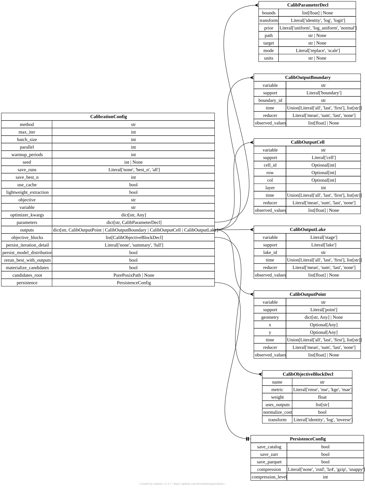

.. AUTO-GENERATED by tools/doc_config. Do not edit by hand.
.. Run ``python -m tools.doc_config`` to refresh.

[calibration] CalibrationConfig
===============================

TOML section: ``[calibration]``

Pydantic model: ``CalibrationConfig``
defined in ``hydromodpy.calibration.config``.

Top-level ``[calibration]`` section.

The config selects the optimizer, iteration budget, candidate persistence
policy, parameter declarations, observable outputs, and objective blocks.
It is the stable user-facing schema used by CLI calibration and
``Project.calibrate``.

When no explicit objective block is declared, HydroModPy can synthesize one
from ``objective`` and ``variable`` if the matching output exists.

Entity-relationship diagram
---------------------------

Fields
------

.. list-table::
   :header-rows: 1
   :widths: 22 26 14 38

   * - Field
     - Type
     - Default
     - Description
   * - ``method``
     - ``<class 'str'>``
     - ``"grid"``
     - Optimization method. Install the calibration extra for optuna or cma_es.
   * - ``max_iter``
     - ``<class 'int'>``
     - ``100``
     - Maximum number of calibration iterations.
   * - ``batch_size``
     - ``<class 'int'>``
     - ``1``
     - Number of suggestions drawn per ask (for parallel optimizers).
   * - ``seed``
     - ``int | None``
     - ``None``
     - Random seed for reproducibility.
   * - ``save_runs``
     - ``Literal['none', 'best_n', 'all']``
     - ``"none"``
     - How much to persist per iteration: - 'none': 1 DuckDB row per iteration, no Zarr. - 'best_n': same + promote top N to full simulations after the loop. - 'all': every iteration becomes a full simulation (Zarr included).
   * - ``save_best_n``
     - ``<class 'int'>``
     - ``10``
     - Number of top iterations to promote when save_runs='best_n'.
   * - ``use_cache``
     - ``<class 'bool'>``
     - ``True``
     - Enable params_hash content-addressable cache.
   * - ``objective``
     - ``<class 'str'>``
     - ``"nse"``
     - Metric key used by the default ScalarObjective.
   * - ``variable``
     - ``<class 'str'>``
     - ``"head"``
     - Observed variable (for ObservationSet).
   * - ``optimizer_kwargs``
     - ``dict[str, Any]``
     - ``factory``
     - Extra keyword arguments forwarded to the optimizer adapter.
   * - ``parameters``
     - ``dict[str, hmp.calibration.config.CalibParameterDecl]``
     - ``factory``
     - Per-parameter declarations (bounds, transform, prior, path).
   * - ``outputs``
     - ``dict[str, hmp.calibration.config.CalibOutputDecl]``
     - ``factory``
     - Named observables extracted from each candidate run.
   * - ``objective_blocks``
     - ``list[hmp.calibration.config.CalibObjectiveBlockDecl]``
     - ``factory``
     - Weighted blocks making up a composite objective. When empty, a single implicit block is built from 'objective' and 'variable'.
   * - ``persist_iteration_detail``
     - ``Literal['none', 'summary', 'full']``
     - ``"summary"``
     - 'none' skips component metrics; 'summary' keeps block totals; 'full' also stores per-block raw and normalized costs.
   * - ``persist_model_distribution``
     - ``<class 'bool'>``
     - ``False``
     - Persist the candidate distribution alongside the session.
   * - ``rerun_best_with_outputs``
     - ``<class 'bool'>``
     - ``False``
     - Replay the best candidate with full outputs after the loop.
   * - ``materialize_candidates``
     - ``<class 'bool'>``
     - ``False``
     - Write a standalone override TOML for each candidate under 'candidates_root' so runs can be replayed later.
   * - ``candidates_root``
     - ``pathlib._local.PurePosixPath | None``
     - ``None``
     - Directory for per-candidate overlay TOMLs. Required when materialize_candidates is True.
   * - ``persistence``
     - ``<class 'hmp.core.config_kit.persistence.PersistenceConfig'>``
     - ``factory``
     - Single switch governing every persistence sink (catalog, Zarr, Parquet, lockfile) for calibration outputs.
