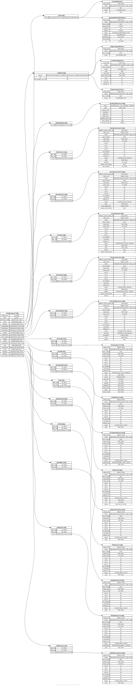

.. AUTO-GENERATED by tools/doc_config. Do not edit by hand.
.. Run ``python -m tools.doc_config`` to refresh.

[data] DataManagersConfig
=========================

TOML section: ``[data]``

Pydantic model: ``DataManagersConfig``
defined in ``hydromodpy.data.data_managers_config``.

Top-level ``[data]`` configuration for manager families.

The `types` list declares user-requested data families. The effective
active set can also include planner-inferred families deduced from other
sections (domain, flow) depending on `inference_mode`.

For each active type, the matching nested section can be validated dynamically:
- `geology` already uses its dedicated Pydantic model (`GeologyConfig`),
- `oceanic` uses `OceanicConfig`,
- the other data families are kept as validated mappings for now.

Use this model for validation only. Runtime activation order is represented
by ``DataLoadPlan`` and loaded by ``DataManagersRuntimeLoader``.

Entity-relationship diagram
---------------------------

Fields
------

.. list-table::
   :header-rows: 1
   :widths: 22 26 14 38

   * - Field
     - Type
     - Default
     - Description
   * - ``project_crs``
     - ``str | None``
     - ``None``
     - EPSG code or WKT string of the project coordinate reference system. When set, all loaded data is reprojected to this CRS. Example: 'EPSG:2154' (Lambert-93).
   * - ``types``
     - ``list[str]``
     - ``factory``
     - Ordered list of data-manager types explicitly requested in [data]. The launcher may append inferred types deduced from other sections (for example domain.zone_ids, flow.active_bc). Allowed values: 'dem', 'etp', 'geology', 'humidity', 'hydrography', 'hydrometry', 'intermittency', 'oceanic', 'piezometry', 'precipitation', 'radiation', 'recharge', 'runoff', 'soil_moisture', 'temperature', 'water_quality', 'wind'.
   * - ``inference_mode``
     - ``Literal['warn', 'strict']``
     - ``"warn"``
     - Policy applied when the planner infers types not explicitly listed in data.types. 'warn': keep inferred types and continue even if data.<type> is missing. 'strict': raise when an inferred type has no explicit data.<type> section (except geology, which can use its default typed config).
   * - ``dem``
     - ``hmp.data.variables.dem.config.DemConfig | None``
     - ``None``
     - DEM configuration used when 'dem' is listed in data.types.
   * - ``geology``
     - ``hmp.data.variables.geology.config.GeologyConfig | None``
     - ``None``
     - Geology configuration used when 'geology' is listed in data.types.
   * - ``hydrography``
     - ``hmp.data.variables.hydrography.config.HydrographyConfig | None``
     - ``None``
     - Hydrography configuration (stream network vector data).
   * - ``hydrometry``
     - ``hmp.data.variables.hydrometry.config.HydrometryConfig | None``
     - ``None``
     - Hydrometry configuration (discharge time-series).
   * - ``intermittency``
     - ``hmp.data.variables.intermittency.config.IntermittencyConfig | None``
     - ``None``
     - Intermittency configuration (ONDE stream flow-state observations).
   * - ``oceanic``
     - ``hmp.data.variables.oceanic.config.OceanicConfig | None``
     - ``None``
     - Oceanic configuration used when 'oceanic' is listed in data.types.
   * - ``piezometry``
     - ``hmp.data.variables.piezometry.config.PiezometryConfig | None``
     - ``None``
     - Piezometry configuration (groundwater level time-series).
   * - ``water_quality``
     - ``hmp.data.variables.water_quality.config.WaterQualityConfig | None``
     - ``None``
     - Water quality configuration (physico-chemical parameters).
   * - ``recharge``
     - ``hmp.data.variables.recharge.config.RechargeConfig | None``
     - ``None``
     - Recharge configuration (drainage / soil infiltration time series).
   * - ``runoff``
     - ``hmp.data.variables.runoff.config.RunoffConfig | None``
     - ``None``
     - Runoff configuration (surface runoff time series).
   * - ``precipitation``
     - ``hmp.data.variables.precipitation.config.PrecipitationConfig | None``
     - ``None``
     - Precipitation configuration (liquid and solid precipitation).
   * - ``etp``
     - ``hmp.data.variables.etp.config.EtpConfig | None``
     - ``None``
     - ETP configuration (potential evapotranspiration).
   * - ``temperature``
     - ``hmp.data.variables.temperature.config.TemperatureConfig | None``
     - ``None``
     - Temperature configuration (air temperature time series).
   * - ``wind``
     - ``hmp.data.variables.wind.config.WindConfig | None``
     - ``None``
     - Wind configuration (wind speed time series).
   * - ``humidity``
     - ``hmp.data.variables.humidity.config.HumidityConfig | None``
     - ``None``
     - Humidity configuration (relative humidity time series).
   * - ``radiation``
     - ``hmp.data.variables.radiation.config.RadiationConfig | None``
     - ``None``
     - Radiation configuration (atmospheric and visible radiation).
   * - ``soil_moisture``
     - ``hmp.data.variables.soil_moisture.config.SoilMoistureConfig | None``
     - ``None``
     - Soil moisture configuration (soil moisture index).
