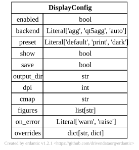

.. AUTO-GENERATED by tools/doc_config. Do not edit by hand.
.. Run ``python -m tools.doc_config`` to refresh.

[display] DisplayConfig
=======================

TOML section: ``[display]``

Pydantic model: ``DisplayConfig``
defined in ``hydromodpy.display.config``.

Display behaviour resolved from the ``[display]`` TOML section.

Entity-relationship diagram
---------------------------

Fields
------

.. list-table::
   :header-rows: 1
   :widths: 22 26 14 38

   * - Field
     - Type
     - Default
     - Description
   * - ``enabled``
     - ``<class 'bool'>``
     - ``True``
     - Master switch. When False, no figure is rendered or saved.
   * - ``backend``
     - ``Literal['agg', 'qt5agg', 'auto']``
     - ``"auto"``
     - Matplotlib backend. 'auto' selects Agg in headless mode and a GUI backend when ``show``
       is enabled.
   * - ``preset``
     - ``Literal['default', 'print', 'dark']``
     - ``"default"``
     - Named theme applied before rendering any figure.
   * - ``show``
     - ``<class 'bool'>``
     - ``False``
     - Open an interactive window via ``matplotlib.pyplot.show``.
   * - ``save``
     - ``<class 'bool'>``
     - ``True``
     - Write rendered figures to disk under ``output_dir``.
   * - ``output_dir``
     - ``<class 'pathlib._local.Path'>``
     - ``PosixPath('figures')``
     - Directory (relative to project root) for saved figures.
   * - ``dpi``
     - ``<class 'int'>``
     - ``150``
     - DPI used when saving raster figures.
   * - ``cmap``
     - ``<class 'str'>``
     - ``"viridis"``
     - Default sequential colormap for spatial figures.
   * - ``figures``
     - ``list[str]``
     - ``factory``
     - Names of registered figures to auto-render at the end of `hmp run` (and consumed by `hmp
       display`). Empty list disables auto-rendering; figures can still be produced later with
       `hmp display <toml>`. Disable per-run via `hmp run --no-display` or for an entire Python
       Project via `Project(..., no_display=True)`.
   * - ``overrides``
     - ``dict[str, dict]``
     - ``factory``
     - Per-figure keyword overrides, keyed by figure name (e.g. ``{'piezometric_map': {'cmap':
       'cividis', 'vmin': 0}}``).
