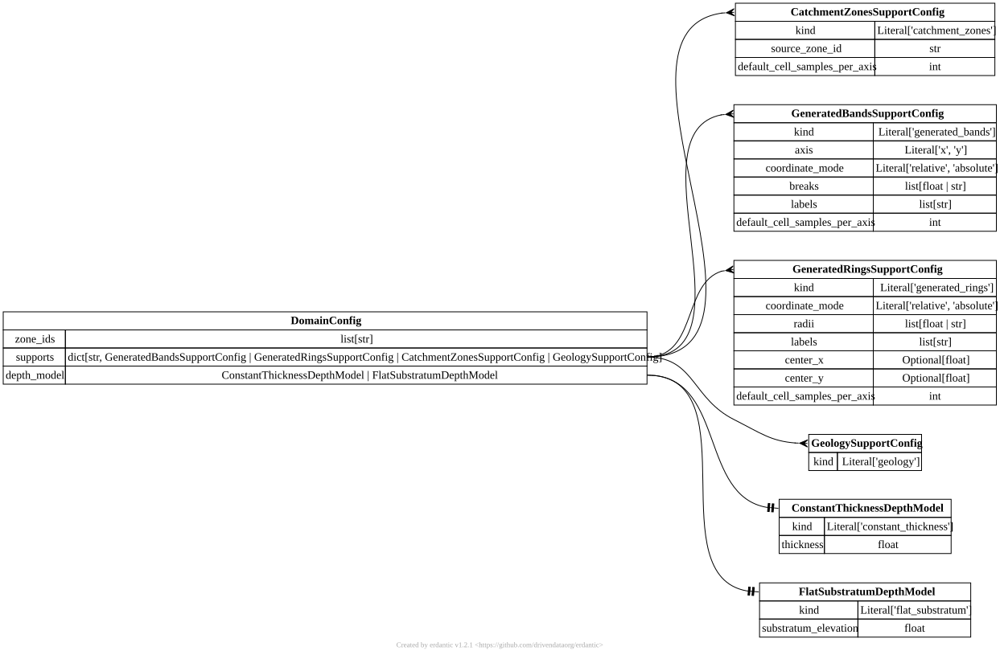

.. AUTO-GENERATED by tools/doc_config. Do not edit by hand.
.. Run ``python -m tools.doc_config`` to refresh.

[domain] DomainConfig
=====================

TOML section: ``[domain]``

Pydantic model: ``DomainConfig``
defined in ``hydromodpy.spatial.domain.domain_config``.

Domain configuration.

Controls which zone providers are loaded in `Domain`.

Entity-relationship diagram
---------------------------

Fields
------

.. list-table::
   :header-rows: 1
   :widths: 22 26 14 38

   * - Field
     - Type
     - Default
     - Description
   * - ``zone_ids``
     - ``list[str]``
     - ``factory``
     - Ordered list of zone identifiers loaded in the domain registry. Keep this list for
       actual runtime zones (for example 'catchment', 'geology', or custom zonations). Spatial-
       support declarations live under domain.supports.
   * - ``supports``
     - ``dict[str, Annotated[hmp.spatial.domain.spatial_support_config.GeneratedBandsSupportConfig | hmp.spatial.domain.spatial_support_config.GeneratedRingsSupportConfig | hmp.spatial.domain.spatial_support_config.CatchmentZonesSupportConfig | hmp.spatial.domain.spatial_support_config.GeologySupportConfig, FieldInfo(annotation=NoneType, required=True, description='Discriminated union of spatial-support providers selected by provider tag.', discriminator='provider')]]``
     - ``factory``
     - Named spatial supports available to heterogeneous parameters. Each key is a support
       identifier referenced by field_spatial_id.
   * - ``depth_model``
     - ``hmp.spatial.domain.depth_model_config.ConstantThicknessDepthModel | hmp.spatial.domain.depth_model_config.FlatSubstratumDepthModel``
     - ``factory``
     - Vertical domain model configuration. Use 'constant_thickness' or 'flat_substratum'.

Cases using this section
------------------------

Validation gallery cases that reference fields from this section:

- :doc:`/capability_gallery/cases/boussinesq_circular_island_piecewise_k_2d`
- :doc:`/capability_gallery/cases/boussinesq_divide_fixed_head_piecewise_k_1d`
- :doc:`/capability_gallery/cases/boussinesq_fixed_head_piecewise_k_1d`
- :doc:`/capability_gallery/cases/boussinesq_sloping_substratum_constant_thickness_1d`
- :doc:`/capability_gallery/cases/boussinesq_sloping_substratum_fixed_head_1d`
- :doc:`/capability_gallery/cases/boussinesq_sloping_substratum_uniform_recharge_1d`
- :doc:`/capability_gallery/cases/boussinesq_uniform_recharge_piecewise_k_1d`
- :doc:`/capability_gallery/cases/brutsaert_recession_boussinesq_thin_1d`
- :doc:`/capability_gallery/cases/brutsaert_recession_linearized_deep_1d`
- :doc:`/capability_gallery/cases/dupuit_circular_island_ocean_2d`
- :doc:`/capability_gallery/cases/dupuit_divide_river_1d`
- :doc:`/capability_gallery/cases/dupuit_fixed_head_1d`
- :doc:`/capability_gallery/cases/dupuit_uniform_recharge_1d`
- :doc:`/capability_gallery/cases/late_time_unconfined_pumping_2d`
- :doc:`/capability_gallery/cases/linearized_unconfined_boundary_piecewise_1d`
- :doc:`/capability_gallery/cases/linearized_unconfined_boundary_step_1d`
- :doc:`/capability_gallery/cases/linearized_unconfined_drainage_1d`
- :doc:`/capability_gallery/cases/linearized_unconfined_hillslope_drainage_1d`
- :doc:`/capability_gallery/cases/linearized_unconfined_recharge_periodic_1d`
- :doc:`/capability_gallery/cases/linearized_unconfined_recharge_step_1d`
- :doc:`/capability_gallery/cases/linearized_unconfined_recharge_step_deep_1d`
