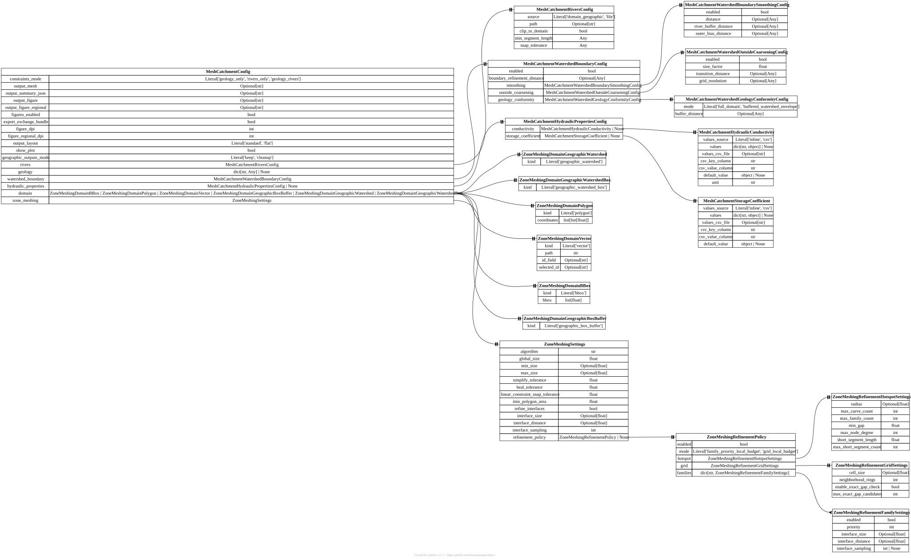

.. AUTO-GENERATED by tools/doc_config. Do not edit by hand.
.. Run ``python -m tools.doc_config`` to refresh.

[mesh_catchment] MeshCatchmentConfig
====================================

TOML section: ``[mesh_catchment]``

Pydantic model: ``MeshCatchmentConfig``
defined in ``hydromodpy.spatial.mesh.config.main``.

Top-level launcher contract for one mono-catchment meshing run.

Entity-relationship diagram
---------------------------

Fields
------

.. list-table::
   :header-rows: 1
   :widths: 22 26 14 38

   * - Field
     - Type
     - Default
     - Description
   * - ``constraints_mode``
     - ``Literal['geology_only', 'rivers_only', 'geology_rivers']``
     - ``"geology_rivers"``
     - Meshing compliance target. 'geology_only' conforms the mesh to geology interfaces only, 'rivers_only' conforms the mesh to river traces only, and 'geology_rivers' enforces both sets of constraints in one mesh.
   * - ``output_mesh``
     - ``str | None``
     - ``None``
     - Optional `.msh` output path for the generated planar mesh. When omitted, the launcher writes the mesh to `results_stable/mesh/mesh_catchment.msh` inside the active catchment workspace in standard layout, or directly to `workspace.project_root/mesh_catchment.msh` when `output_layout='flat'` is used.
   * - ``output_summary_json``
     - ``str | None``
     - ``None``
     - Optional JSON sidecar path for QA metrics, cleaned-input diagnostics, and summary metadata describing the generated mesh. When omitted, the launcher writes it next to the default mesh output.
   * - ``output_figure``
     - ``str | None``
     - ``None``
     - Optional overview figure path. Use it when you want a quick visual QA artifact showing the support domain, geology zones, river constraints, and final mesh footprint.
   * - ``output_figure_regional``
     - ``str | None``
     - ``None``
     - Optional regional overview figure path. When omitted but output_figure is set, the launcher writes a second figure next to the main one with suffix `_regional` to show where the catchment sits on the full DEM.
   * - ``figures_enabled``
     - ``<class 'bool'>``
     - ``True``
     - If true, generate the overview figure artifacts when figure output paths are configured. Set it to false to skip figure creation entirely, even in batch mode where default filename patterns are present.
   * - ``export_exchange_bundle``
     - ``<class 'bool'>``
     - ``True``
     - If true, export the solver-exchange mesh bundle next to the generated mesh. Set it to false for profiling or mesh-only runs that do not need bundle metadata. Downstream solvers that require runtime mesh support may fail without this bundle.
   * - ``figure_dpi``
     - ``<class 'int'>``
     - ``300``
     - Pixel density used when rendering the main mesh overview figure. Increase it when you need to inspect mesh edges and constraints more closely in the saved PNG.
   * - ``figure_regional_dpi``
     - ``<class 'int'>``
     - ``220``
     - Pixel density used when rendering the regional overview figure. Keep it lower than figure_dpi when you want detailed local mesh inspection without making the regional PNG too heavy.
   * - ``output_layout``
     - ``<class 'str'>``
     - ``"standard"``
     - Dedicated-launcher output layout. Use 'standard' to keep final mesh artifacts under `results_stable/mesh/`, or 'flat' to write final mesh artifacts directly under `workspace.project_root` while keeping intermediate runtime folders out of that final directory.
   * - ``show_plot``
     - ``<class 'bool'>``
     - ``False``
     - If true, open the generated overview figure interactively at the end of the run. Keep it false for batch or headless execution.
   * - ``geographic_outputs_mode``
     - ``<class 'str'>``
     - ``"keep"``
     - Control what happens to intermediate geographic preprocessing artifacts after the mesh run. Use 'keep' to preserve the canonical `results_stable/geographic` and `results_stable/demcorrecflow` folders, or 'cleanup' to delete them at the end of the dedicated mesh launcher once the mesh outputs and exchange bundle have been written.
   * - ``rivers``
     - ``<class 'hmp.spatial.mesh.config.rivers.MeshCatchmentRiversConfig'>``
     - ``factory``
     - River-constraint section used when constraints_mode includes rivers. The default behavior is to reuse the in-memory river trace already built by the geographic pipeline.
   * - ``geology``
     - ``dict[str, Any] | None``
     - ``None``
     - Optional geology support used when constraints_mode includes geology. This section defines which polygon source represents lithological zones and how those polygons should be interpreted before conformal meshing. Validated through the geology data-source Protocol; stored as a normalized mapping.
   * - ``watershed_boundary``
     - ``<class 'hmp.spatial.mesh.config.watershed.MeshCatchmentWatershedBoundaryConfig'>``
     - ``factory``
     - Optional watershed-boundary mesh constraint. Enable it to force a conformal mesh line along the catchment boundary while keeping the geology zonation represented on the whole support domain.
   * - ``hydraulic_properties``
     - ``hmp.spatial.mesh.config.hydraulic.MeshCatchmentHydraulicPropertiesConfig | None``
     - ``None``
     - Optional hydraulic-property tables keyed by geology zones. The launcher projects geology on the mesh and exports per-cell conductivity/storage values as weighted averages of geology fractions.
   * - ``domain``
     - ``hmp.spatial.mesh.gmsh_grid.zone_meshing._domain_schema.ZoneMeshingDomainBBox | hmp.spatial.mesh.gmsh_grid.zone_meshing._domain_schema.ZoneMeshingDomainPolygon | hmp.spatial.mesh.gmsh_grid.zone_meshing._domain_schema.ZoneMeshingDomainVector | hmp.spatial.mesh.gmsh_grid.zone_meshing._domain_schema.ZoneMeshingDomainGeographicBoxBuffer | hmp.spatial.mesh.gmsh_grid.zone_meshing._domain_schema.ZoneMeshingDomainGeographicWatershed | hmp.spatial.mesh.gmsh_grid.zone_meshing._domain_schema.ZoneMeshingDomainGeographicWatershedBox``
     - ``factory``
     - Effective support domain to mesh. The default `geographic_box_buffer` mode reuses the catchment bounding box plus geographic buffer prepared during delineation, which is usually the right support for mono-catchment meshing.
   * - ``zone_meshing``
     - ``<class 'hmp.spatial.mesh.gmsh_grid.zone_meshing.config.ZoneMeshingSettings'>``
     - ``factory``
     - Low-level Gmsh sizing and cleanup parameters controlling cell size, simplification, and interface refinement. Defaults are valid, but project examples typically override them to target a desired number of cells.
