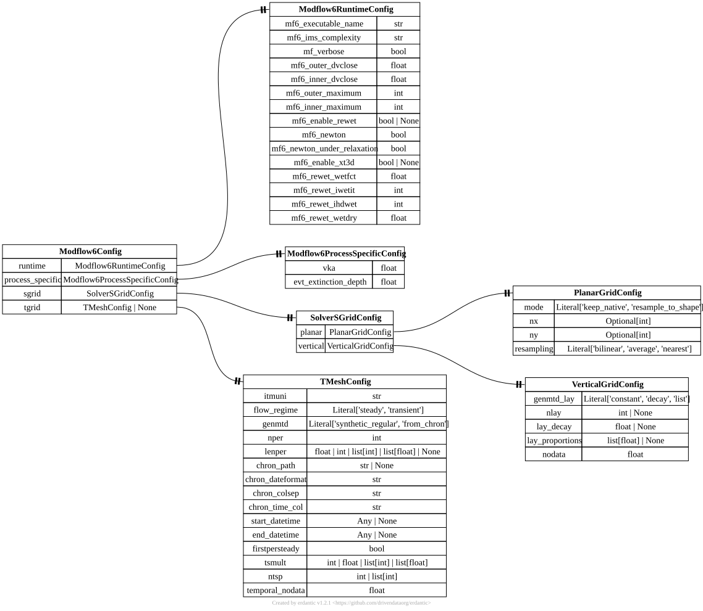

.. AUTO-GENERATED by tools/doc_config. Do not edit by hand.
.. Run ``python -m tools.doc_config`` to refresh.

[modflow6] Modflow6Config
=========================

TOML section: ``[modflow6]``

Pydantic model: ``Modflow6Config``
defined in ``hydromodpy.solver.modflow6.modflow6_config``.

Expert-level MODFLOW 6 configuration organized by concern.

Entity-relationship diagram
---------------------------

Fields
------

.. list-table::
   :header-rows: 1
   :widths: 22 26 14 38

   * - Field
     - Type
     - Default
     - Description
   * - ``runtime``
     - ``<class 'hmp.solver.modflow6.modflow6_config.Modflow6RuntimeConfig'>``
     - ``factory``
     - MODFLOW 6 runtime options.
   * - ``process_specific``
     - ``<class 'hmp.solver.modflow6.modflow6_config.Modflow6ProcessSpecificConfig'>``
     - ``factory``
     - Process-specific controls for MODFLOW 6 flow packages.
   * - ``sgrid``
     - ``<class 'hmp.spatial.mesh.cartesian_grid.sgrid_config.SolverSGridConfig'>``
     - ``factory``
     - Solver-grid payload split into planar and vertical sections.
   * - ``tgrid``
     - ``hmp.solver.utils.temporal.tmesh_config.TMeshConfig | None``
     - ``None``
     - Optional temporal discretization payload as TMeshConfig. In launcher mode, stress
       periods are driven by [simulation.time]; this section is mirrored for compatibility and
       mainly keeps `firstpersteady`.

Cases using this section
------------------------

Validation gallery cases that reference fields from this section:

- :doc:`/capability_gallery/cases/boussinesq_circular_island_piecewise_k_2d`
- :doc:`/capability_gallery/cases/boussinesq_divide_fixed_head_piecewise_k_1d`
- :doc:`/capability_gallery/cases/boussinesq_fixed_head_piecewise_k_1d`
- :doc:`/capability_gallery/cases/boussinesq_sloping_substratum_constant_thickness_1d`
- :doc:`/capability_gallery/cases/boussinesq_sloping_substratum_fixed_head_1d`
- :doc:`/capability_gallery/cases/boussinesq_sloping_substratum_uniform_recharge_1d`
- :doc:`/capability_gallery/cases/boussinesq_uniform_recharge_piecewise_k_1d`
- :doc:`/capability_gallery/cases/brutsaert_recession_boussinesq_thin_1d`
- :doc:`/capability_gallery/cases/brutsaert_recession_linearized_deep_1d`
- :doc:`/capability_gallery/cases/dupuit_circular_island_ocean_2d`
- :doc:`/capability_gallery/cases/dupuit_divide_river_1d`
- :doc:`/capability_gallery/cases/dupuit_fixed_head_1d`
- :doc:`/capability_gallery/cases/dupuit_uniform_recharge_1d`
- :doc:`/capability_gallery/cases/late_time_unconfined_pumping_2d`
- :doc:`/capability_gallery/cases/linearized_unconfined_boundary_piecewise_1d`
- :doc:`/capability_gallery/cases/linearized_unconfined_boundary_step_1d`
- :doc:`/capability_gallery/cases/linearized_unconfined_drainage_1d`
- :doc:`/capability_gallery/cases/linearized_unconfined_hillslope_drainage_1d`
- :doc:`/capability_gallery/cases/linearized_unconfined_recharge_periodic_1d`
- :doc:`/capability_gallery/cases/linearized_unconfined_recharge_step_1d`
- :doc:`/capability_gallery/cases/linearized_unconfined_recharge_step_deep_1d`
