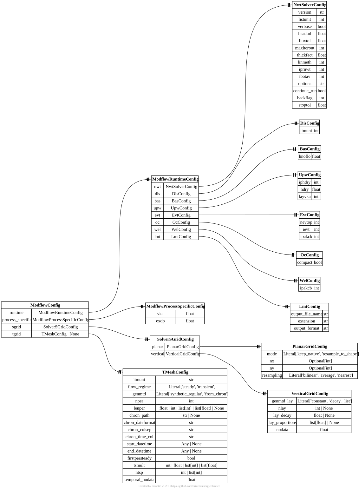

.. AUTO-GENERATED by tools/doc_config. Do not edit by hand.
.. Run ``python -m tools.doc_config`` to refresh.

[modflownwt] ModflowConfig
==========================

TOML section: ``[modflownwt]``

Pydantic model: ``ModflowConfig``
defined in ``hydromodpy.solver.modflow_nwt.nwt.nwt_config``.

Expert-level MODFLOW configuration organized by concern.

Entity-relationship diagram
---------------------------

Fields
------

.. list-table::
   :header-rows: 1
   :widths: 22 26 14 38

   * - Field
     - Type
     - Default
     - Description
   * - ``runtime``
     - ``<class 'hmp.solver.modflow_nwt.nwt.nwt_config.ModflowRuntimeConfig'>``
     - ``factory``
     - MODFLOW runtime package options (NWT/DIS/BAS/UPW/EVT/OC/WEL/LMT).
   * - ``process_specific``
     - ``<class 'hmp.solver.modflow_nwt.nwt.nwt_config.ModflowProcessSpecificConfig'>``
     - ``factory``
     - Process-specific package controls (currently UPW/EVT knobs).
   * - ``sgrid``
     - ``<class 'hmp.spatial.mesh.cartesian_grid.sgrid_config.SolverSGridConfig'>``
     - ``factory``
     - Spatial-grid payload split into `[...sgrid.planar]` and `[...sgrid.vertical]`.
   * - ``tgrid``
     - ``hmp.solver.utils.temporal.tmesh_config.TMeshConfig | None``
     - ``None``
     - Optional temporal discretization payload as one validated `TMeshConfig` model. In launcher mode, stress periods are driven by [simulation.time]; this section is mirrored for compatibility and mainly keeps `firstpersteady`.
