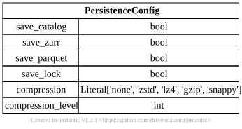

.. AUTO-GENERATED by tools/doc_config. Do not edit by hand.
.. Run ``python -m tools.doc_config`` to refresh.

[persistence] PersistenceConfig
===============================

TOML section: ``[persistence]``

Pydantic model: ``PersistenceConfig``
defined in ``hydromodpy.core.config_kit.persistence``.

Orthogonal switch governing every persistence sink.

Toggles are independent: disabling ``save_zarr`` does not silence the
catalog, and vice versa. ``save_catalog`` is the master switch for the
project DuckDB; when False, every write through
:class:`SimulationCatalog` becomes a no-op.

Entity-relationship diagram
---------------------------

Fields
------

.. list-table::
   :header-rows: 1
   :widths: 22 26 14 38

   * - Field
     - Type
     - Default
     - Description
   * - ``save_catalog``
     - ``<class 'bool'>``
     - ``True``
     - Persist DuckDB rows (simulations, parameters, metrics, calibration_iterations). When
       False, catalog writes are skipped.
   * - ``save_zarr``
     - ``<class 'bool'>``
     - ``True``
     - Persist per-simulation field arrays (head, concentration, derived) into the Zarr store.
   * - ``save_parquet``
     - ``<class 'bool'>``
     - ``True``
     - Persist per-simulation tabular outputs (timeseries, budgets, mass_balance) as Parquet
       files.
   * - ``save_lock``
     - ``<class 'bool'>``
     - ``True``
     - Generate and refresh the ``hydromodpy.lock`` reproducibility manifest after data
       ingestion.
   * - ``compression``
     - ``Literal['none', 'zstd', 'lz4', 'gzip', 'snappy']``
     - ``"zstd"``
     - Codec used for Zarr field arrays and Parquet tables. 'none' disables compression.
   * - ``compression_level``
     - ``<class 'int'>``
     - ``3``
     - Compression level (codec-dependent). Ignored when compression='none'.
