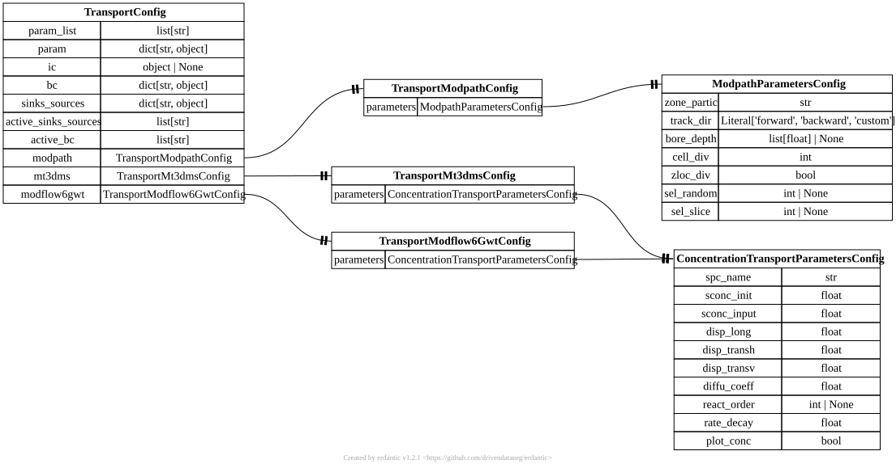

.. AUTO-GENERATED by tools/doc_config. Do not edit by hand.
.. Run ``python -m tools.doc_config`` to refresh.

[transport] TransportConfig
===========================

TOML section: ``[transport]``

Pydantic model: ``TransportConfig``
defined in ``hydromodpy.physics.transport.transport_config``.

Transport-process configuration.

Entity-relationship diagram
---------------------------

Fields
------

.. list-table::
   :header-rows: 1
   :widths: 22 26 14 38

   * - Field
     - Type
     - Default
     - Description
   * - ``param_list``
     - ``list[str]``
     - ``factory``
     - Inherited generic parameter list (excluded from transport serialization).
   * - ``param``
     - ``dict[str, object]``
     - ``factory``
     - Inherited generic parameter map (excluded from transport serialization).
   * - ``ic``
     - ``object | None``
     - ``None``
     - Inherited initial-condition payload (excluded from transport serialization).
   * - ``bc``
     - ``dict[str, object]``
     - ``factory``
     - Inherited boundary-condition map (excluded from transport serialization).
   * - ``sinks_sources``
     - ``dict[str, object]``
     - ``factory``
     - Inherited sinks/sources map (excluded from transport serialization).
   * - ``active_sinks_sources``
     - ``list[str]``
     - ``factory``
     - Ordered list of sink/source identifiers that are explicitly activated for this process. An empty list means no sink/source is active. Concrete process configs (e.g. FlowConfig) validate the allowed values.
   * - ``active_bc``
     - ``list[str]``
     - ``factory``
     - Ordered list of boundary-condition identifiers that are explicitly activated for this process. An empty list means no boundary-condition package is assembled. Concrete process configs (e.g. FlowConfig) validate the allowed values.
   * - ``modpath``
     - ``<class 'hmp.physics.transport.transport_config.TransportModpathConfig'>``
     - ``factory``
     - Modpath solver configuration block.
   * - ``mt3dms``
     - ``<class 'hmp.physics.transport.transport_config.TransportMt3dmsConfig'>``
     - ``factory``
     - MT3DMS solver configuration block.
   * - ``modflow6gwt``
     - ``<class 'hmp.physics.transport.transport_config.TransportModflow6GwtConfig'>``
     - ``factory``
     - MODFLOW 6 GWT solver configuration block.
