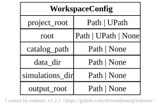

.. AUTO-GENERATED by tools/doc_config. Do not edit by hand.
.. Run ``python -m tools.doc_config`` to refresh.

[workspace] WorkspaceConfig
===========================

TOML section: ``[workspace]``

Pydantic model: ``WorkspaceConfig``
defined in ``hydromodpy.core.workspace.config``.

Strict-binary workspace configuration.

The canonical workspace layout is::

    <workspace>/
        data/
            cache.duckdb
        projects/
            <name>/
                project.toml   <- TOML lives here when using scaffold
                hydromodpy.duckdb
                simulations/
                    <basename>.zarr/ or <basename>.zarr.zip

Fields under ``[workspace]``:

``project_root`` (required)
    Directory of the project TOML. Usually auto-derived from the TOML
    location by the loader.

``root`` (explicit workspace override)
    When set, the shared data workspace root. Derives ``data_dir``
    unless it is explicitly overridden.

``catalog_path`` / ``data_dir`` / ``simulations_dir``
    Per-component explicit overrides. ``catalog_path`` and
    ``simulations_dir`` are project-local by default.

``output_root``
    Optional redirect for heavy outputs (``.solver_scratch/`` and
    per-run ``figures/``). Defaults to ``project_root``.

Entity-relationship diagram
---------------------------

Fields
------

.. list-table::
   :header-rows: 1
   :widths: 22 26 14 38

   * - Field
     - Type
     - Default
     - Description
   * - ``project_root``
     - ``<class 'pathlib._local.Path'>``
     - ``required``
     - Path to the project directory. Auto-derived from TOML location when absent.
   * - ``root``
     - ``pathlib._local.Path | None``
     - ``None``
     - Explicit shared data workspace root. When set, derives data_dir unless it is overridden.
       Result catalogs stay project-local by default.
   * - ``catalog_path``
     - ``pathlib._local.Path | None``
     - ``None``
     - Explicit path to the project hydromodpy.duckdb. Defaults to
       <project_root>/hydromodpy.duckdb.
   * - ``data_dir``
     - ``pathlib._local.Path | None``
     - ``None``
     - Explicit path to the workspace data directory. Defaults to <root>/data.
   * - ``simulations_dir``
     - ``pathlib._local.Path | None``
     - ``None``
     - Explicit path to the simulations Zarr directory. Defaults to <project_root>/simulations.
   * - ``output_root``
     - ``pathlib._local.Path | None``
     - ``None``
     - Root directory for per-project outputs (.solver_scratch/, figures/). Defaults to
       project_root when not set. Use this to redirect heavy outputs to a separate disk.
