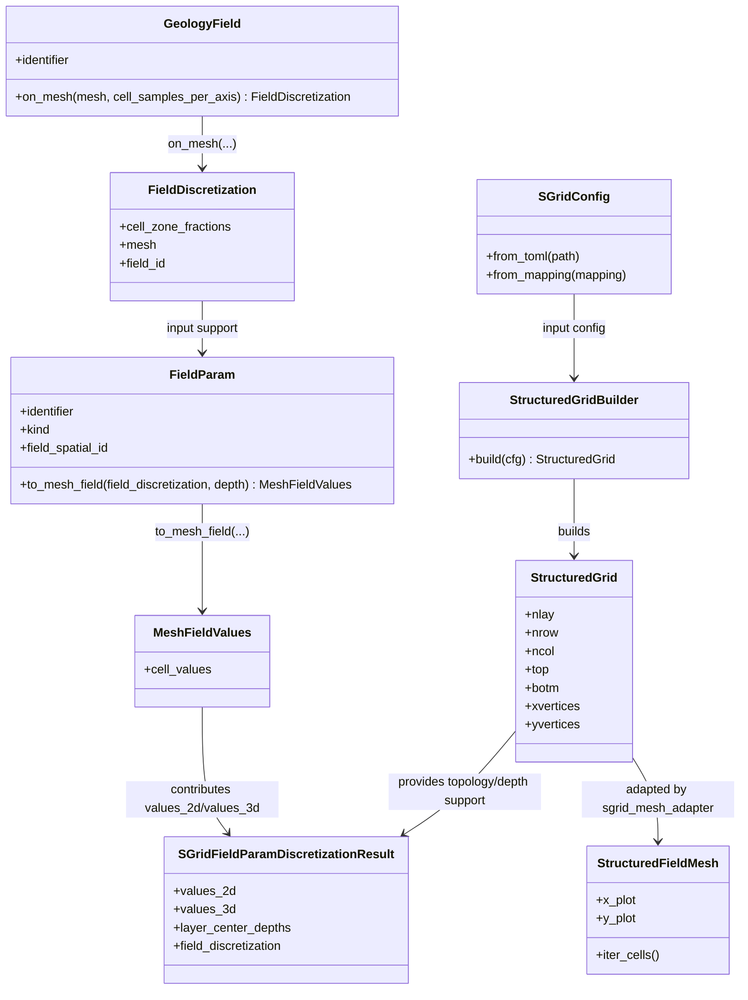
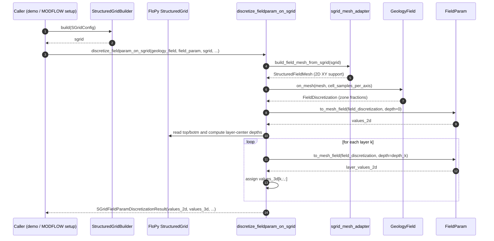

# Grid

`hydromodpy/solver/utils/mesh/cartesian_grid/` contains utilities used to build model grids for HydroModPy.

## Directory Map

```text
hydromodpy/solver/utils/mesh/cartesian_grid/
|-- sgrid_generation.py
|-- utils/
|   |-- raster_grid_reader.py
|   `-- planar_discretizer.py
|-- sgrid_config.py
|-- sgrid_mesh_adapter.py
|-- sgrid_fieldparam_discretization.py
|-- examples/
|   |-- generation/
|   |   |-- run_grid_demo.py
|   |   |-- run_grid_demo_config.toml
|   |   `-- watershed_box_buff_dem.tif
|   `-- discretization/
|       |-- run_demo_2d.py
|       |-- run_demo.py
|       |-- run_demo_config.py
|       `-- run_demo_config_2d.toml
|-- __init__.py
`-- README.md
```

## What This Module Does

### Spatial grid (`StructuredGridBuilder`)

`StructuredGridBuilder` builds a FloPy `StructuredGrid` from:

- one top raster (DEM),
- one bottom definition method,
- one vertical layering strategy.

It is used by the MODFLOW workflow in
`hydromodpy/solver/modflow_nwt/modflow.py` to feed `flopy.modflow.ModflowDis`.

Supported bottom generation methods:

- `filepath` (from `bot_path` raster file),
- `raster` (from `bot_raster` array),
- `constant_thickness` (from `thick`),
- `constant_altitude` (from `zbot`).

Supported layering methods:

- `constant` (`nlay`),
- `decay` (`nlay`, `lay_decay`),
- `list` (`lay_proportions`).

Current limitation:

- only `sgrid_type = "structured"` is implemented,
- `unstructured` and `vertex` are placeholders.
- TOML interface currently supports `genmtd_bot` in
  `filepath|raster|constant_thickness|constant_altitude`.

Implementation note:

- `SGridConfig` (Pydantic) is the single source of validation.
- `RasterGridReader` isolates raster I/O (`rasterio`) from builder logic.
- `PlanarDiscretizer` handles `nx/ny` re-discretization and interpolation policy.
- `StructuredGridBuilder` performs only deterministic construction from validated config.

## FieldParam Discretization: 2D Support, 3D Evaluation

For `sgrid_fieldparam_discretization`, the current architecture is intentionally
split in two stages:

1. **2D spatial support (XY only)**:
   - `sgrid_mesh_adapter` adapts only horizontal vertices (`x`, `y`) to
     `StructuredFieldMesh`.
   - `geology_field.on_mesh(...)` computes per-cell zone fractions on that
     planar mesh.
2. **3D value evaluation on SGrid layers**:
   - layer-center depths are computed from `sgrid.top` and `sgrid.botm`,
   - `FieldParam` values are evaluated for each layer to build
     `values_3d (nlay, nrow, ncol)`.

This is **not** a bug: geology support is raster-based and currently 2D, while
final solver properties are produced in 3D.

### Why `sgrid_mesh_adapter` stays 2D

`sgrid_mesh_adapter` is the bridge to the generic `field` stack, and that stack
is currently defined over planar cells (`x`, `y` polygons). A full 3D adapter
would require a dedicated volumetric field contract (3D cells / 3D geology
support), which is outside the current scope.

### Backward Compatibility and Plots

- `SGridFieldParamDiscretizationResult.values_3d` is the reference output for
  solver injection.
- `SGridFieldParamDiscretizationResult.values_2d` is kept for compatibility and
  for existing **plan-view** figures in cartesian-grid examples.
- 3D figures can be added later without changing this compatibility layer.

### Pipeline Schematic

```text
            +-------------------------+
            | FloPy StructuredGrid    |
            | (nlay, nrow, ncol)      |
            +-----------+-------------+
                        |
                        | XY vertices only
                        v
            +-------------------------+
            | sgrid_mesh_adapter      |
            | -> StructuredFieldMesh  |
            |    (2D cells)           |
            +-----------+-------------+
                        |
                        | geology projection in plan
                        v
            +-------------------------+
            | geology_field.on_mesh   |
            | -> zone fractions (2D)  |
            +-----------+-------------+
                        |
                        | FieldParam mapping
                        v
            +-------------------------+
            | surface values (2D)     |
            +-----------+-------------+
                        |
                        | evaluate by layer-center depth
                        v
            +-------------------------+
            | values_3d               |
            | (nlay, nrow, ncol)      |
            +-------------------------+

Legacy compatibility:
- values_2d is still exported for existing plan-view demos.
```

### UML Class Diagram (Grid + Field/FieldParam Coupling)



### UML Activity Diagram (Grid Filling Through `Field` and `FieldParam`)

```mermaid
flowchart TD
    A[Load/validate SGrid config] --> B[Build FloPy StructuredGrid]
    B --> C[Adapt SGrid XY vertices to StructuredFieldMesh 2D]
    C --> D[Project geology on mesh: geology_field.on_mesh(...)]
    D --> E[Build 2D surface values: field_param.to_mesh_field(..., depth=0)]
    E --> F[Initialize values_3d by extrusion of values_2d]
    F --> G[Compute layer-center depths from top/botm]
    G --> H{For each layer k}
    H --> I[Evaluate FieldParam at depth_k]
    I --> J[Write layer slice values_3d[k,:,:]]
    J --> H
    H -->|done| K[Return SGridFieldParamDiscretizationResult]
```

### UML Sequence Diagram (Detailed Runtime Calls)



Notes for interpretation:

- The mesh adapter is intentionally 2D (plan-view support only).
- 3D behavior comes from repeated `FieldParam.to_mesh_field(...)` evaluations with depth.
- This is the expected design for the current geology + parameter pipeline, not a temporary workaround.

## Planar Discretization (`plan_discretization_mode`)

Two planar modes are supported:

- `raster_native`: keep the top raster native shape and resolution.
- `shape`: resample to an explicit target shape (`ny` rows, `nx` columns).

In `shape` mode:

- the modeled extent is preserved (same raster bounds),
- cell sizes become `dx = (xmax - xmin)/nx` and `dy = (ymax - ymin)/ny`,
- top and bottom rasters are aligned on the same target grid before vertical layering.

Resampling rule used by `PlanarDiscretizer`:

- upsampling (more pixels than source): `bilinear`,
- downsampling (fewer pixels than source): `average`.

## Vertical Layer Thickness Distribution (`genmtd_lay`)

This section documents the three supported ways to distribute thickness over layers.
The choice of `genmtd_lay` controls how `botm` is generated between the top surface
and the model bottom.

Common definition for all methods:

- Let local total thickness be `H(i,j) = top(i,j) - bot(i,j)`.
- Each layer `k` gets a fraction `p_k` of `H(i,j)`.
- Fractions always sum to 1, so full thickness is preserved cell by cell.
- Layer bottoms use cumulative fractions `P_k = sum_{m=1..k}(p_m)`.
- The generated bottom of layer `k` is `botm[k,i,j] = top(i,j) - H(i,j) * P_k`.

### `constant` distribution

Inputs:

- `genmtd_lay="constant"`
- `nlay` (required)

Definition:

- `p_k = 1/nlay` for all layers.

Behavior:

- Every layer gets identical thickness at a given `(i,j)`.
- If `H(i,j)` varies spatially, absolute thickness still varies spatially, but
  the vertical proportion is uniform.

### `decay` distribution

Inputs:

- `genmtd_lay="decay"`
- `nlay` (required)
- `lay_decay > 1` (required)

Definition:

- Let `r = lay_decay`.
- Cumulative fractions are:
  `P_k = (1 - r^k) / (1 - r^nlay)`.
- Layer fractions are `p_k = P_k - P_{k-1}` with `P_0 = 0`.

Behavior:

- Upper layers are thinner, deeper layers are thicker.
- `r` close to 1 gives a profile close to `constant`.
- Larger `r` increases contrast between shallow and deep layer thicknesses.

### `list` distribution

Inputs:

- `genmtd_lay="list"`
- `lay_proportions` (required)
- optional `nlay` (if provided, it must match `len(lay_proportions)`)

Definition:

- User provides explicit `p_k` values (strictly positive, sum = 1).
- Example: `[0.1, 0.2, 0.3, 0.4]`.

Behavior:

- Full control on vertical discretization profile.
- Recommended when geological horizons imply specific layer thickness ratios.

### Practical QA notes for layering

- `SGridConfig` validates required fields and constraints for each method.
- `lay_proportions` are validated as strictly positive and summing to 1.
- `nodata` masking is propagated to generated `botm`.
- To avoid non-physical layers, ensure input bottom definition produces
  `bot(i,j) < top(i,j)` on valid cells.

### Configuration Parameters (`SGridConfig`)

- `sgrid_type`: grid family selector (`structured`, `unstructured`, `vertex`), currently only `structured` is executable.
- `lenuni`: length unit label stored in FloPy grid metadata.
- `genmtd_top`: top-surface method (`filepath` only for now).
- `top_path`: path to the top DEM raster (required).
- `crs`: optional CRS string stored in resulting grid metadata.
- `plan_discretization_mode`: planar mode (`raster_native` or `shape`).
- `nx`: target number of columns when `plan_discretization_mode="shape"`.
- `ny`: target number of rows when `plan_discretization_mode="shape"`.
- `genmtd_bot`: bottom-surface method (`filepath`, `raster`, `constant_thickness`, `constant_altitude`).
- `bot_path`: bottom raster path when `genmtd_bot="filepath"`.
- `bot_raster`: in-memory bottom raster when `genmtd_bot="raster"`.
- `thick`: domain thickness when `genmtd_bot="constant_thickness"`.
- `zbot`: uniform bottom altitude when `genmtd_bot="constant_altitude"`.
- `genmtd_lay`: vertical-layering strategy (`constant`, `decay`, `list`).
- `nlay`: number of layers for `constant` and `decay`.
- `lay_decay`: decay exponent (>1) for `decay`.
- `lay_proportions`: per-layer thickness fractions for `list` (must be positive and sum to 1).
- `nodata`: no-data sentinel used for masking invalid raster cells.

### Temporal grid

Temporal discretization is now separated from cartesian mesh tools and lives in:

- `hydromodpy/solver/utils/temporal/tgrid_generation.py`

## Minimal Example (Spatial Grid)

```python
from hydromodpy.solver.utils.mesh.cartesian_grid.sgrid_config import SGridConfig
from hydromodpy.solver.utils.mesh.cartesian_grid.sgrid_generation import StructuredGridBuilder

cfg = SGridConfig(
    top_path="path/to/top_dem.tif",
    crs="EPSG:2154",
    nodata=-9999,
    genmtd_bot="constant_thickness",
    thick=100.0,
    genmtd_lay="constant",
    nlay=3,
)

sgrid = StructuredGridBuilder().build(cfg)

print(sgrid.nlay, sgrid.nrow, sgrid.ncol)
```

## TOML + Pydantic Interface (Spatial Grid)

You can configure the grid directly from TOML:

```python
from hydromodpy.solver.utils.mesh.cartesian_grid.sgrid_config import SGridConfig
from hydromodpy.solver.utils.mesh.cartesian_grid.sgrid_generation import StructuredGridBuilder

cfg = SGridConfig.from_toml("hydromodpy/solver/utils/mesh/cartesian_grid/examples/generation/run_grid_demo_config.toml")
sgrid = StructuredGridBuilder().build(cfg)
print(sgrid.nlay, sgrid.nrow, sgrid.ncol)
```

Associated files:

- `hydromodpy/solver/utils/mesh/cartesian_grid/sgrid_config.py`: Pydantic schema + TOML loading helpers.
- `hydromodpy/solver/utils/mesh/cartesian_grid/utils/raster_grid_reader.py`: raster I/O adapter used by the builder.
- `hydromodpy/solver/utils/mesh/cartesian_grid/utils/planar_discretizer.py`: planar regridding (`nx`/`ny`) and raster interpolation.
- `hydromodpy/solver/utils/mesh/cartesian_grid/examples/generation/run_grid_demo_config.toml`: ready-to-run configuration example.

## Returned Object

`StructuredGridBuilder.build(cfg)` returns a FloPy `StructuredGrid` exposing standard
attributes used downstream by MODFLOW setup:

- `lenuni`, `nlay`, `nrow`, `ncol`,
- `delr`, `delc`,
- `top`, `botm`,
- offsets and extent metadata.
