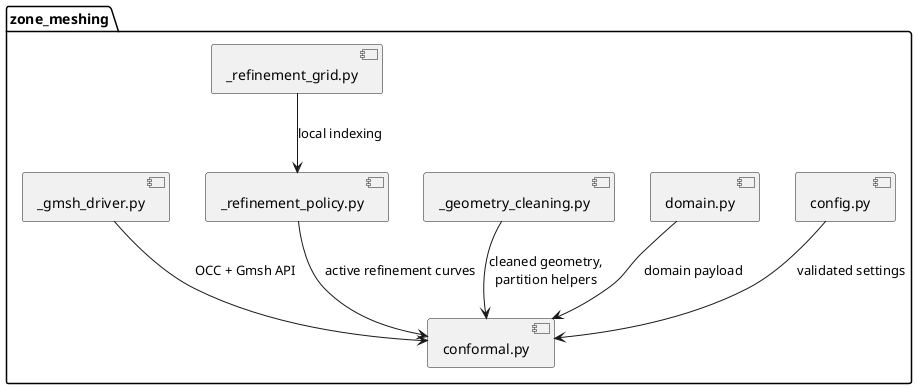
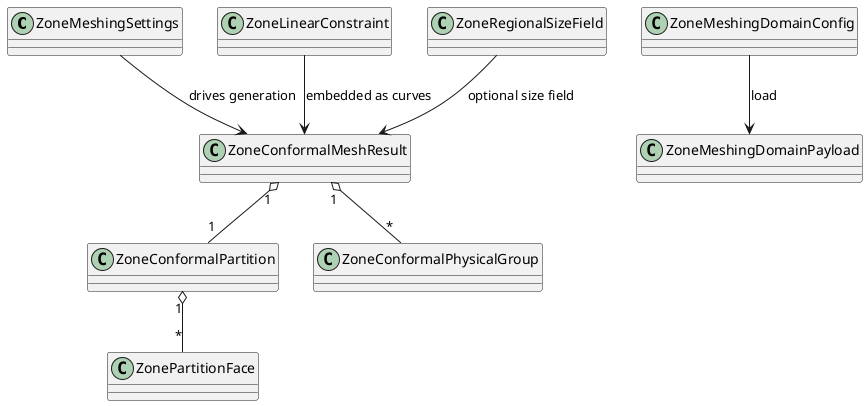
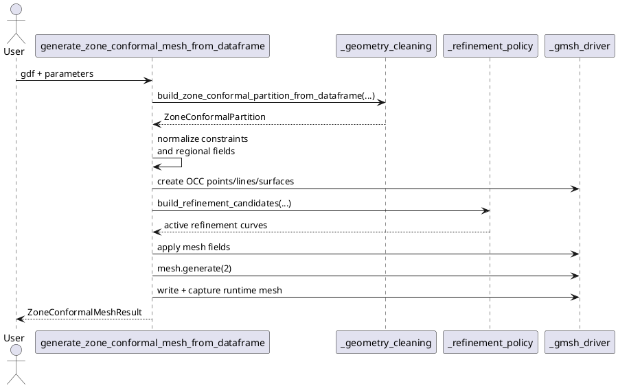
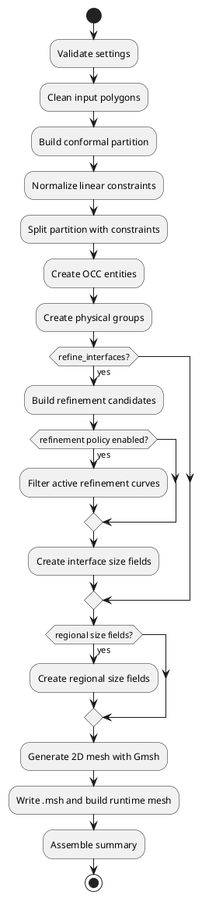

# UML

Ce fichier propose des diagrammes UML simples pour documenter le coeur
`zone_meshing`.

Les diagrammes sont ecrits en `plantuml` pour rester textuels, versionnables et
faciles a faire evoluer.

## 1. Diagramme De Composants

Ce diagramme montre la separation des responsabilites.

## 2. Diagramme De Classes

Ce diagramme cible les contrats publics manipules le plus souvent.

## 3. Diagramme De Sequence

Ce diagramme montre le workflow principal quand on part d'un `GeoDataFrame`.

## 4. Diagramme D'Activite

Ce diagramme montre les grandes etapes du pipeline.

## Diagrammes UML Recommandes A Maintenir

Je recommande de maintenir en priorite :

- le diagramme de composants, pour expliquer l'architecture du package ;
- le diagramme de classes, pour documenter les contrats publics ;
- le diagramme de sequence, pour expliquer comment utiliser le code depuis
  l'exterieur ;
- le diagramme d'activite, pour garder une vue simple du pipeline.

Sur des evolutions plus profondes, un cinquieme diagramme utile serait un
diagramme de sequence dedie au workflow `mesh_catchment -> case planning ->
zone_meshing`.
