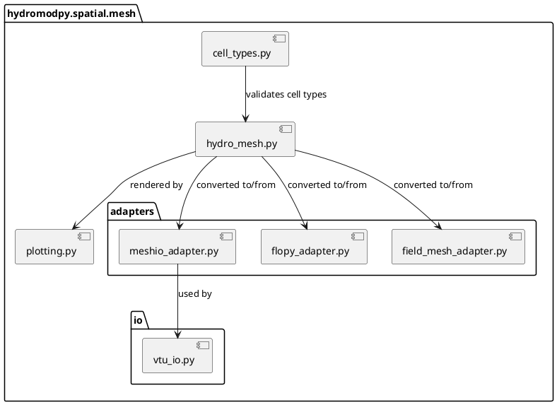
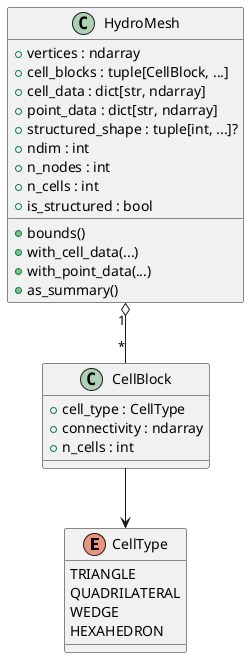
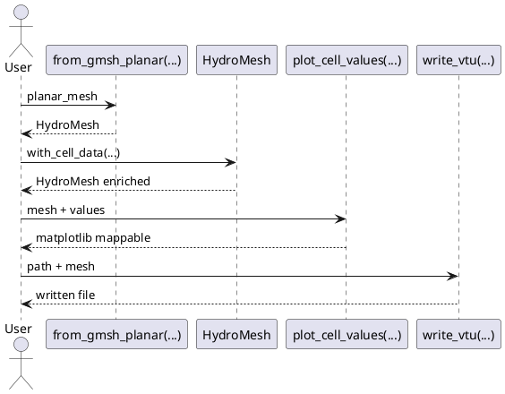
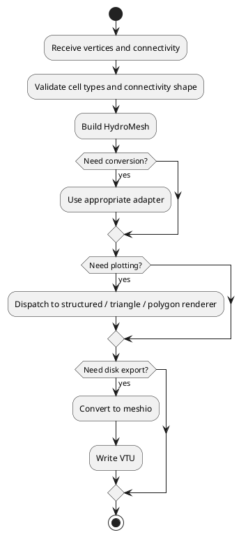

# UML

Ce fichier propose quelques diagrammes UML simples pour documenter le package
`hydromodpy.spatial.mesh`.

Les diagrammes sont fournis en `plantuml` pour rester :

- textuels ;
- faciles a versionner ;
- faciles a mettre a jour pendant les refactors.

## 1. Diagramme De Composants

## 2. Diagramme De Classes

## 3. Diagramme De Sequence

Exemple d'usage externe typique :

## 4. Diagramme D'Activite

## Diagrammes Les Plus Utiles A Maintenir

Je recommande de maintenir en priorite :

- le diagramme de composants, pour expliquer la separation pivot /
  adapters / io / plotting ;
- le diagramme de classes, pour documenter `HydroMesh` comme contrat de
  donnees ;
- le diagramme de sequence, pour montrer comment le package est utilise de
  l'exterieur.
