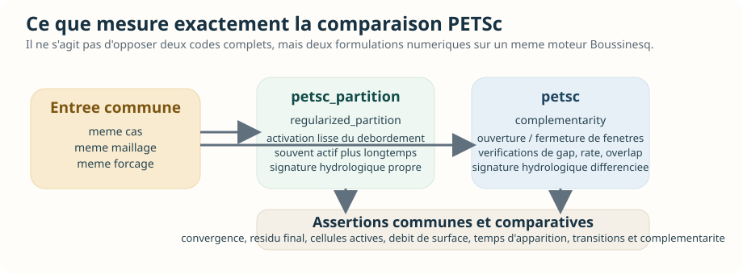
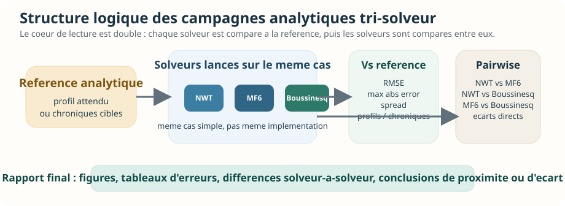

# Inventaire des tests d'intercomparaison

Date: `2026-04-14`

## Perimetre retenu

Dans ce depot, j'appelle **test d'intercomparaison** un test ou un script qui compare
plusieurs solveurs, backends ou methodes sur un meme cas.

Je separe volontairement :

- les **intercomparaisons scientifiques automatisees**,
- la **couverture unitaire de soutien** autour de ces scenarios,
- les **tests de l'infrastructure generique d'intercomparaison**,
- les **benchmarks d'intercomparaison en calibration**,
- les **scripts d'intercomparaison non ou peu testes**.

## 1. Intercomparaisons scientifiques automatisees

Ce sont les cas les plus proches d'un "vrai" inventaire de tests d'intercomparaison
au sens scientifique.

### 1.1 Comparaisons PETSc/Boussinesq sur cas numeriques

| Fichier | Nature | Portee |
| --- | --- | --- |
| `tests/validation/numerical/transient/test_boussinesq_hillslope_recharge_pulse_overflow_petsc.py` | `1` test parametre, `4` executions | Compare `petsc_partition` et `petsc` sur le cas numerique transitoire d'overflow de versant, avec variantes de forcage (`strong`, `alternating`). |
| `tests/validation/numerical/steady/test_boussinesq_headwater_100km2_petsc.py` | `1` test parametre, `2` executions | Compare les deux fermetures de surface PETSc (`regularized_partition` vs `complementarity`) sur un bassin reel `headwater_100km2` en regime stationnaire. |
| `tests/validation/numerical/transient/test_boussinesq_headwater_100km2_petsc_transient.py` | `3` tests, dont `1` parametre | Compare les deux fermetures PETSc sur cas reel transitoire, puis verifie qu'elles se distinguent bien sur des forcages `cycling recharge`, homogenes et heterogenes. |

### 1.2 Resume

- `3` fichiers de validation numerique d'intercomparaison
- `5` fonctions de test
- `10` executions pytest effectives en tenant compte des parametrisations
- contraintes d'environnement :
  - Linux uniquement pour les cas PETSc,
  - `petsc4py` requis,
  - plusieurs tests sont marques `slow`

## Partie detaillee - intercomparaison de solveurs

Cette section zoome uniquement sur l'intercomparaison de solveurs, au sens
large, et exclut volontairement les benchmarks de calibration.

Le point cle a retenir est le suivant :

- le depot contient beaucoup de materiel de comparaison solveur-a-solveur,
- mais la partie **strictement automatisee comme validation scientifique pytest**
  reste aujourd'hui concentree sur la famille `boussinesq` PETSc,
- les comparaisons `MODFLOW-NWT` vs `MODFLOW 6` vs `Boussinesq` existent surtout
  sous forme de scripts de campagne, de rapports exportes et d'infrastructure
  generique, pas encore sous forme d'une grosse batterie pytest end-to-end avec
  seuils d'acceptation solver-a-solver centralises.

### Lecture visuelle rapide

> Si vous ne retenez qu'une seule idee : la validation solveur-a-solveur la plus stricte est aujourd'hui concentree sur `petsc_partition` vs `petsc`. Les comparaisons multi-codes `MODFLOW-NWT` / `MODFLOW 6` / `Boussinesq` sont deja nombreuses, mais elles vivent surtout comme campagnes reproductibles, infrastructure de comparaison et artefacts exportes.

*Figure 1. Le rapport couvre bien plusieurs couches, mais la partie "preuve scientifique automatisee" reste ciblee. Le reste du depot sert surtout a comparer, diagnostiquer, produire des artefacts et preparer une future industrialisation des comparaisons multi-codes.*

*Figure 2. Les comparaisons ne portent pas toutes sur des codes entierement differents. Certaines opposent deux solveurs distincts, d'autres deux backends ou deux fermetures numeriques a l'interieur de la meme famille.*

### Carte des solveurs et variantes compares

| Identifiant | Nature exacte | Statut dans le depot |
| --- | --- | --- |
| `modflownwt` | solveur MODFLOW-NWT | compare dans scripts analytiques, scripts transitoires, benchmark Linux, launcher `method_comparison` |
| `modflow6` | solveur MODFLOW 6 sur maillage structure | compare dans scripts analytiques, scripts transitoires, launcher `method_comparison`, cas a substratum incline |
| `modflow6_irregular_tri` | variante MF6 sur triangles irreguliers | compare dans les scripts transitoires de versant et de substratum incline |
| `boussinesq` | runtime local dense Boussinesq | compare dans scripts analytiques, scripts transitoires, benchmark Linux, multi-solver overflow |
| `petsc_partition` | runtime Boussinesq PETSc avec loi de surface `regularized_partition` | compare dans les validations numeriques strictes et dans les campagnes multi-solveurs |
| `petsc` | runtime Boussinesq PETSc avec formulation `complementarity` | compare dans les validations numeriques strictes et dans les campagnes multi-solveurs |
| `scipy_sparse` | variante non-PETSc Boussinesq mentionnee comme reference de comparaison | disponible dans le cas overflow, mais peu visible dans la couverture pytest courante |

### Axes de comparaison effectivement presents

| Axe | Ce qui est compare | Exemples |
| --- | --- | --- |
| famille de solveurs | `modflownwt` vs `modflow6` vs `boussinesq` | `tools/validation_compare_simple_cases.py`, `tools/validation_compare_transient_simple_cases.py` |
| fermetures de surface dans Boussinesq | `petsc_partition` vs `petsc` | `tests/validation/numerical/*petsc*.py`, `run_multi_solver_case.py` |
| backend local vs backend PETSc | `boussinesq` local vs `petsc_partition` vs `petsc` | `tools/investigate_linux_nwt_boussinesq_transient.py`, `run_multi_solver_case.py` |
| meme solveur, maillages differents | `modflow6` structure vs `modflow6_irregular_tri` | `tools/investigate_sloping_substratum_transient.py` |
| solveurs differents, meme maillage | `modflow6` vs `boussinesq` sur `mesh_input` partage | `run_method_comparison_example12_fast_shared_mesh.toml` |
| solveurs differents, maillages differents | `modflow6` triangulaire vs `modflownwt` structure | `run_method_comparison_mf6_vs_nwt_different_meshes.toml` |
| solveur-a-verite analytique puis solver-a-solver | chaque solveur contre la reference, puis pairwise entre solveurs | `vscs_20260412`, `vtcs_20260412` |

### Lecture operationnelle par niveau de couverture

| Niveau | Ce que cela veut dire | Situation actuelle |
| --- | --- | --- |
| `A` | validation scientifique pytest bout en bout, avec assertions numeriques | present surtout pour `petsc_partition` vs `petsc` |
| `B` | script de campagne reproductible qui lance plusieurs solveurs et publie un rapport | present et assez riche |
| `C` | infrastructure generique d'intercomparaison et tests de plomberie | tres present avec `launchers/method_comparison` |
| `D` | artefacts deja produits dans `out/` | present sur plusieurs scenarios recents |

### 1. Famille de comparaison la plus stricte : Boussinesq PETSc

La seule famille vraiment couverte en validation pytest solver-a-solver stricte
est aujourd'hui la comparaison des deux formulations de surface sur le runtime
PETSc de `boussinesq`.

#### Schema de lecture du bloc PETSc

*Figure 3. La question scientifique n'est pas "quel code gagne ?", mais "deux formulations distinctes sur le meme cas produisent-elles des comportements differencies, coherents et numeriquement sains ?".*

#### 1.1 Cas `boussinesq_hillslope_recharge_pulse_overflow_1d`

Fichier :

- `tests/validation/numerical/transient/test_boussinesq_hillslope_recharge_pulse_overflow_petsc.py`

Ce qui est compare :

- `petsc_partition`
- `petsc`

Forcages exerces par le test :

- cas nominal PETSc partition,
- cas nominal PETSc complementarity,
- preset `strong`,
- preset `alternating`

Ce qui est verifie :

- activation effective du seuil de debordement de surface,
- existence d'un debordement total non nul,
- existence d'une longueur active non nulle,
- existence d'un temps d'apparition fini,
- coherence entre le resume runtime et les diagnostics reconstruits,
- pour `petsc`, convergence de chaque periode,
- pour `petsc`, respect de la tolerance residuelle,
- pour `petsc` en mode `alternating`, multiplicite des fenetres d'activation et des transitions,
- pour `petsc`, respect des metriques de complementarite :
  - gap minimum,
  - taux minimum,
  - overlap maximal.

Interpretation :

- ce test ne compare pas encore `MODFLOW-NWT` ou `MODFLOW 6`,
- il compare deux lois de fermeture sur un meme moteur numerique,
- c'est donc une intercomparaison de solveur au sens "backend numerique / loi de surface",
  pas une intercomparaison multi-code generale.

#### 1.2 Cas reel `headwater_100km2` stationnaire

Fichier :

- `tests/validation/numerical/steady/test_boussinesq_headwater_100km2_petsc.py`

Ce qui est compare :

- `run_headwater_100km2_outlet_2_boussinesq_petsc_partition_mesh_input.toml`
- `run_headwater_100km2_outlet_2_boussinesq_petsc_mesh_input.toml`

Nature de la comparaison :

- meme bassin reel,
- meme maillage commite,
- meme famille `boussinesq`,
- fermeture de surface differente.

Ce qui est verifie :

- le runtime est bien `petsc`,
- la fermeture resolue correspond a la config attendue,
- le solveur stationnaire itere effectivement,
- le seuil de surface s'active,
- le nombre de cellules actives et le debit total de surface sont significatifs,
- pour la formulation `complementarity`, les contraintes de complementarite restent respectees.

#### 1.3 Cas reel `headwater_100km2` transitoire

Fichier :

- `tests/validation/numerical/transient/test_boussinesq_headwater_100km2_petsc_transient.py`

Ce qui est compare :

- cas transitoire pulse : `petsc_partition` vs `petsc`,
- cas `cycling recharge` homogene : `petsc_partition` vs `petsc`,
- cas `cycling recharge` heterogene : `petsc_partition` vs `petsc`.

Ce qui est verifie sur le cas pulse :

- runtime `petsc`,
- bon choix de fermeture,
- convergence de toutes les periodes,
- residual final sous tolerance,
- activation du seuil de surface,
- nombre de cellules actives et debit de surface suffisamment eleves,
- contraintes de complementarite quand la formulation mixte est activee.

Ce qui est verifie sur les cas `cycling recharge` :

- la fermeture `regularized_partition` reste quasiment toujours active,
- la fermeture `complementarity` ouvre et ferme plusieurs fenetres de debordement,
- le nombre de pas actifs, de transitions et de fenetres differe fortement entre les deux formulations,
- la formulation mixte revient a `0` cellule active en fin de sequence,
- les contraintes de complementarite restent satisfaites.

Lecture scientifique :

- ces tests ne cherchent pas une "verite" externe,
- ils cherchent a prouver que deux formulations numeriques distinctes produisent
  des signatures hydrologiques distinctes et coherentes sur un meme cas.

### 2. Scripts de campagne tri-solveur `MODFLOW-NWT` / `MODFLOW 6` / `Boussinesq`

Ce volet est important : la comparaison multi-code existe bien dans le depot,
mais elle vit surtout dans des scripts de campagne et dans des rapports, pas
encore dans des validations pytest centralisees.

#### Schema de lecture des campagnes tri-solveur

*Figure 4. Les scripts `validation_compare_simple_cases.py` et `validation_compare_transient_simple_cases.py` ont deja la structure d'un banc de comparaison. Ce qui leur manque surtout aujourd'hui, c'est une fermeture pytest centralisee avec seuils solver-a-solver geles.*

#### 2.1 Cas analytiques simples stationnaires

Script :

- `tools/validation_compare_simple_cases.py`

Solveurs compares :

- `modflownwt`
- `modflow6`
- `boussinesq`

Cas compares :

- `dupuit_fixed_head_1d`
- `dupuit_uniform_recharge_1d`
- `boussinesq_fixed_head_piecewise_k_1d`

Logique de comparaison :

- chaque solveur est d'abord compare a la reference analytique du cas,
- un second niveau calcule les ecarts pairwise solveur-a-solveur,
- des figures sont generees avec :
  - profil analytique,
  - profils numeriques,
  - residus solveur-reference,
  - differences solveur-solveur.

Metriques sorties :

- `rmse_vs_analytical_m`
- `max_abs_error_vs_analytical_m`
- `cross_row_spread_m`
- `pairwise_profile_rmse_m`
- `pairwise_max_abs_error_m`
- `pairwise_mean_abs_error_m`

Artefact deja present :

- `out/vscs_20260412`

Exemples de signal deja observe dans cet artefact :

- sur `dupuit_fixed_head_1d`, `MODFLOW-NWT` et `MODFLOW 6` restent tres proches
  (`pairwise RMSE = 0.0054 m`), alors que `Boussinesq` est nettement plus loin
  (`0.0449 m` contre NWT, `0.0429 m` contre MF6) ;
- sur `boussinesq_fixed_head_piecewise_k_1d`, `MODFLOW-NWT` et `MODFLOW 6`
  restent encore proches (`0.0035 m` pairwise RMSE), tandis que `Boussinesq`
  s'ecarte davantage (`0.0318 m` contre NWT, `0.0307 m` contre MF6).

Conclusion :

- le script joue deja le role d'un mini banc d'intercomparaison tri-solveur,
- mais il n'est pas protege par un test end-to-end qui imposerait des seuils
  solver-a-solver stables dans pytest.

#### 2.2 Cas analytiques simples transitoires

Script :

- `tools/validation_compare_transient_simple_cases.py`

Solveurs compares :

- `modflownwt`
- `modflow6`
- `boussinesq`

Cas compares :

- `lu_recharge_step_1d`
- `lu_boundary_step_1d`
- `lu_recharge_step_deep_1d`

Metriques sorties :

- `space_time_rmse_m`
- `space_time_max_abs_error_m`
- `final_profile_rmse_m`
- `final_profile_max_abs_error_m`
- `row_spread_m`
- `pairwise_final_profile_rmse_m`
- `pairwise_final_profile_max_abs_error_m`
- `pairwise_monitor_rmse_m`
- `pairwise_monitor_max_abs_error_m`

Artefact deja present :

- `out/vtcs_20260412`

Exemples de signal deja observe :

- sur `lu_recharge_step_1d`, `MODFLOW-NWT` et `MODFLOW 6` sont quasiment
  indiscernables sur le profil final (`pairwise final-profile RMSE = 0.0000 m`),
  alors que `Boussinesq` s'eloigne (`0.0182 m` et `0.0181 m`) ;
- sur `lu_boundary_step_1d`, l'ecart final reste faible pour tous, mais
  `Boussinesq` reste plus distant sur les moniteurs temporels ;
- sur `lu_recharge_step_deep_1d`, le cas profond resserre les ecarts, mais
  `MODFLOW-NWT` et `MODFLOW 6` restent les plus proches l'un de l'autre.

Conclusion :

- le depot dispose deja d'un observatoire tri-solveur analytique stationnaire et transitoire,
- mais cet observatoire est aujourd'hui outille comme script de reporting,
  pas comme suite pytest numerique solver-a-solver.

### 3. Scripts d'investigation multi-solveurs sur cas de versant

#### 3.1 `tools/investigate_surface_interaction_hillslope_transient.py`

Ce script est le coeur des campagnes transitoires de versant avec drainage.

Solveurs compares :

- `modflownwt`
- `modflow6`
- `modflow6_irregular_tri`
- `boussinesq`

Cas :

- versant synthetique incline,
- recharge croissante puis decroissante,
- une annee humide suivie d'une annee seche,
- drainage de surface,
- comparaison des hydrogrammes, charges et chroniques de debordement.

Sorties produites :

- `timeseries.csv`
- `summary_metrics.csv`
- `execution_times.csv`
- `head_point_timeseries.csv`
- `summary.md`
- figures de profils, flux, budget, temps d'execution.

Couverture actuelle :

- `tests/unit/tools/test_investigate_surface_interaction_hillslope_transient.py`
  couvre les helpers critiques,
- mais pas la campagne complete avec execution de tous les solveurs.

#### 3.2 `tools/investigate_linux_nwt_boussinesq_transient.py`

Solveurs compares :

- `modflownwt`
- `boussinesq` local
- `petsc_partition`
- `petsc`

Cas :

- meme versant,
- `4` mois de montee,
- `4` mois de descente,
- `6` mois a recharge nulle,
- pas de temps `10 jours`.

Artefact deja present :

- `out/linux_nwt_bouss_4m4m6m_20260414`

Signal numerique deja observe dans cet artefact :

- apparition du debit a `10 jours` pour les quatre solveurs,
- pic de debit total :
  - `51.9696 m3/day` pour `MODFLOW-NWT`,
  - `17.1092 m3/day` pour `Boussinesq local`,
  - `56.5275 m3/day` pour `PETSc regularized_partition`,
  - `65.4825 m3/day` pour `PETSc complementarity`,
- temps mur :
  - `30.11 s` pour `MODFLOW-NWT`,
  - `0.54 s` pour `Boussinesq local`,
  - `16.64 s` pour `PETSc partition`,
  - `11.89 s` pour `PETSc complementarity`.

Lecture :

- ce script expose deja un benchmark multi-code tres informatif,
- mais il reste un benchmark d'investigation, pas un test pytest de non-regression scientifique.

#### 3.3 `tools/investigate_sloping_substratum_transient.py`

Solveurs compares :

- `modflownwt`
- `modflow6` structure
- `modflow6_irregular_tri`
- `boussinesq`

Cas :

- topographie a `12 deg`,
- substratum a `10 deg`,
- un seul exutoire impose a l'est,
- recharge transitoire,
- comparaison sur support structure et sur bundle triangulaire explicite.

Artefact deja present :

- `out/sih_sloping_substratum_10deg_20260414`

Signal deja observe :

- `MODFLOW-NWT` et `MODFLOW 6 structured` ne montrent aucun debit total sur ce run exporte,
- `MODFLOW 6 irregular triangles` monte a `7.5906 m3/day`,
- `Boussinesq` monte a `61.6073 m3/day`,
- le cas est donc interessant parce qu'il met en evidence une forte sensibilite
  au couple solveur + support geometrique.

#### 3.4 `run_multi_solver_case.py` pour le cas overflow

Fichier :

- `validation_cases/numerical/transient/boussinesq_hillslope_recharge_pulse_overflow_1d/run_multi_solver_case.py`

Solveurs compares par defaut :

- `boussinesq`
- `petsc_partition`
- `petsc`

Rendu principal :

- superposition du debit total de debordement,
- superposition du debit total de sortie,
- profils de charge a dates choisies,
- budget complet,
- chroniques en points,
- temps d'execution.

Artefact deja present :

- `out/boussinesq_hillslope_overflow_multi_linux_windows_context_20260414`

Signal deja observe :

- `boussinesq` local et `PETSc regularized_partition` sont quasiment superposes
  sur ce contexte Windows :
  - debut du debordement a `3.00 jours`,
  - pic de debordement `~168.12 m3/day`,
  - meme clearance maximale `-0.5788 m`,
- `PETSc complementarity` se distingue fortement :
  - apparition beaucoup plus tardive a `19.00 jours`,
  - pic plus faible `100.256 m3/day`,
  - clearance bien plus proche de la surface `-0.1194 m`.

Lecture :

- c'est probablement l'exemple le plus lisible du depot pour montrer
  l'effet propre de la loi de fermeture de surface sur un meme cas.

### 4. Infrastructure generique `launchers/method_comparison`

`launchers/method_comparison` n'est pas un test scientifique en soi ; c'est la
boite a outils qui permet de comparer des variantes solveur/maillage a partir
de sorties `_postprocess`.

#### Schema de la chaine `method_comparison`

*Figure 5. L'infrastructure est deja tres solide pour normaliser, comparer et publier. C'est un multiplicateur de valeur pour les campagnes multi-solveurs, mais elle doit etre branchee a des seuils d'acceptation si l'on veut une validation automatique forte.*

#### 4.1 Ce que l'infrastructure sait faire

- comparer des variantes sur meme maillage ou maillages differents,
- extraire des observables de type `point`, `outlet`, `map`, `cell_mask`,
- aligner les temps avec des cles de comparaison et des fallback de type
  `time_selector:last`,
- reconstruire un `outlet_flux` meme quand les solveurs ne publient pas la meme
  variable native,
- produire :
  - `observables.csv`,
  - `comparison_metrics.csv`,
  - `comparison_differences.csv`,
  - `comparison_metrics.json`,
  - `comparison_report.md`,
  - des figures de cartes, differences, series et tableaux de bord,
  - des CSV de chroniques natives et des barres de temps d'execution.

#### 4.2 Couverture de test directe

Fichier principal :

- `tests/unit/launchers/test_method_comparison_launcher.py`

Ce que couvrent explicitement les tests :

- resolution des chemins et overlays,
- ancrages spatiaux (`anchors_file`),
- extraction d'observables ponctuels, cartes et flux d'exutoire,
- conversion du flux d'exutoire Boussinesq et MODFLOW,
- masquage `nodata`,
- refus d'un `outlet` sans localisation explicite,
- generation des figures :
  - `map_comparison`,
  - `difference_map`,
  - `timeseries`,
  - `point_dashboard`,
  - `native_flux_panel`,
  - `execution_time_bars`,
- calcul des metriques `mae`, `rmse`, alignement temporel et strategie de fallback.

Exemple precise d'assertion de plomberie :

- un test verifie qu'un `head_at_point` decale de `2.0 m` donne bien une
  `mae = 2.0`,
- un autre verifie que des selections `last` sur indices de temps differents
  s'alignent quand meme via `fallback_time_key`.

#### 4.3 Configurations d'exemple deja reliees a cette infrastructure

| Configuration | Type de comparaison |
| --- | --- |
| `run_method_comparison_mf6_vs_nwt_same_regular_mesh.toml` | `MODFLOW 6` vs `MODFLOW-NWT` sur meme maillage structure, avec observables `point`, `map`, `outlet` |
| `run_method_comparison_mf6_vs_nwt_different_meshes.toml` | `MODFLOW 6` triangulaire via `mesh_input` vs `MODFLOW-NWT` structure, principalement sur observables `map` |
| `run_method_comparison_mf6_vs_nwt_different_meshes_demonstrative.toml` | variante demonstrative plus riche avec `point`, `outlet` et plusieurs cartes |
| `run_method_comparison_example12_multi_method_moderate.toml` | comparaison multi-variantes melangeant structure et `mesh_input` |
| `run_method_comparison_example12_fast_shared_mesh.toml` | `MODFLOW 6` vs `Boussinesq` sur meme maillage triangulaire versionne |
| `run_method_comparison_example12_extensive_mf6_vs_nwt.toml` | comparaison plus lourde `MF6` vs `NWT` |
| `run_method_comparison_headwater_100km2_outlet_2_backends.toml` | trois backends sur un bassin reel et un bundle committe |
| `run_method_comparison_headwater_100km2_outlet_2_transient_pulsed_recharge_backends.toml` | comparaison backend sur cas reel transitoire pulse |
| `run_method_comparison_headwater_100km2_outlet_2_transient_cycling_recharge_heterogeneous_backends.toml` | comparaison backend sur cas reel transitoire heterogene |
| `run_method_comparison_headwater_100km2_outlet_2_mf6_transient_scenarios.toml` | comparaison scenario-vs-scenario a l'interieur de MF6 (`mf6_reference` vs `mf6_heterogeneous_decay`) |

Point important :

- la presence de ces configs dans les tests veut dire qu'elles se chargent et
  respectent le contrat d'infrastructure,
- cela ne veut pas dire qu'elles sont toutes executees en validation
  scientifique avec seuils solveur-a-solveur.

### 5. Ce qui est reellement automatise aujourd'hui

#### 5.1 Oui, automatise scientifiquement

- comparaison `petsc_partition` vs `petsc` sur cas numeriques cibles,
- verification de convergence, d'activation des seuils, de fenetres
  d'activation et de contraintes de complementarite.

#### 5.2 Oui, automatise comme outillage

- toute la plomberie `method_comparison`,
- les helpers d'investigation transitoire,
- les runners multi-solveurs autour du cas overflow.

#### 5.3 Oui, executable et deja utilise, mais pas verrouille en pytest

- comparaisons tri-solveur analytiques `vscs` et `vtcs`,
- benchmark Linux `MODFLOW-NWT` vs `Boussinesq`,
- intercomparaison transitoire a substratum incline,
- campagnes de versant avec `MODFLOW-NWT`, `MODFLOW 6`, `MF6 irregular`, `Boussinesq`.

#### 5.4 Pas encore present

- une suite pytest unique qui lancerait regulierement un vrai banc
  `MODFLOW-NWT` vs `MODFLOW 6` vs `Boussinesq` avec seuils pairwise stabilises ;
- une registry centrale des comparaisons solver-a-solver avec statut
  `strict validation` / `campaign script` / `infrastructure only` ;
- une normalisation unique des metriques pairwise pour tous les scripts de
  campagne.

## 2. Couverture unitaire de soutien des scenarios d'intercomparaison

Ces tests ne valident pas le phenomene physique bout en bout, mais securisent les
outils et les cas utilises par les intercomparaisons.

| Fichier | Nombre de tests | Role principal |
| --- | ---: | --- |
| `tests/unit/validation/test_hillslope_pulse_overflow_case.py` | `10` | Contrat du cas `boussinesq_hillslope_recharge_pulse_overflow_1d` : presets, diagnostics, selection de snapshots, gestion du solveur de comparaison. |
| `tests/unit/validation_cases/test_boussinesq_hillslope_overflow_multi_solver.py` | `5` | Contrat du runner multi-solveur `run_multi_solver_case.py` : normalisation des solveurs, exports CSV, presets de contexte. |
| `tests/unit/tools/test_investigate_surface_interaction_hillslope_transient.py` | `8` | Contrat du script d'investigation transitoire multi-solveur avec drainage de surface. |
| `tests/unit/tools/test_investigate_linux_nwt_boussinesq_transient.py` | `2` | Contrat du benchmark Linux `MODFLOW-NWT` vs variantes `Boussinesq`. |
| `tests/unit/tools/test_investigate_sloping_substratum_transient.py` | `3` | Contrat geometrique du cas transitoire a substratum incline. |

Resume :

- `5` fichiers
- `28` tests unitaires de soutien

## 3. Infrastructure generique d'intercomparaison

Le depot contient un moteur generique dedie aux comparaisons solveur/maillage :
`launchers/method_comparison`.

### 3.1 Tests principaux

| Fichier | Nombre de tests | Role principal |
| --- | ---: | --- |
| `tests/unit/launchers/test_method_comparison_launcher.py` | `24` | Couvre la configuration, l'extraction d'observables, les sorties CSV/JSON/Markdown, les figures, les flux d'exutoire, les cartes, le mode reuse, les metriques et le dispatch CLI `launchers method-comparison`. |

### 3.2 Tests satellites

| Fichier | Nombre de tests relies | Role principal |
| --- | ---: | --- |
| `tests/unit/launchers/test_hmp_simulation_cli.py` | `1` | Verifie le dispatch `hmp compare` vers `MethodComparisonLauncher`. |
| `tests/unit/launchers/test_regional_lab_launcher.py` | `1` | Verifie l'extraction d'artefacts enfants produits par un `method_comparison`. |
| `tests/unit/launchers/test_realistic_campaign_runner.py` | `1` | Verifie le chargement de la config `run_method_comparison_headwater_100km2_outlet_2_mf6_transient_scenarios.toml`. |

### 3.3 Configurations d'exemple explicitement couvertes

Le test `test_example_method_comparison_configs_load` charge explicitement les
configurations suivantes :

- `run_method_comparison_mf6_vs_nwt_same_regular_mesh.toml`
- `run_method_comparison_mf6_vs_nwt_different_meshes.toml`
- `run_method_comparison_mf6_vs_nwt_different_meshes_demonstrative.toml`
- `run_method_comparison_example12_multi_method_moderate.toml`
- `run_method_comparison_example12_fast_shared_mesh.toml`
- `run_method_comparison_example12_extensive_mf6_vs_nwt.toml`
- `run_method_comparison_headwater_100km2_outlet_2_backends.toml`
- `run_method_comparison_headwater_100km2_outlet_2_transient_pulsed_recharge_backends.toml`
- `run_method_comparison_headwater_100km2_outlet_2_transient_cycling_recharge_heterogeneous_backends.toml`

Une dixieme configuration orientee campagne est testee a part :

- `run_method_comparison_headwater_100km2_outlet_2_mf6_transient_scenarios.toml`

Resume :

- `27` tests relies a l'infrastructure `method_comparison`
- couverture large de l'outillage, mais pas de validation scientifique bout en bout

## 4. Intercomparaisons de calibration

Ce ne sont pas des comparaisons de solveurs, mais des **intercomparaisons de
methodes d'inversion** sur un meme benchmark `same-solver twin`.

### 4.1 Tests de validation calibration

| Fichier | Regime | Nature |
| --- | --- | --- |
| `tests/validation/calibration/test_twin_dupuit_fixed_head_modflow6.py` | steady | benchmark de reference rapide sur `dupuit_fixed_head_1d` |
| `tests/validation/calibration/test_twin_dupuit_fixed_head_posterior_modflow6.py` | steady | benchmark oriente distribution/posterior |
| `tests/validation/calibration/test_twin_dupuit_fixed_head_mesh_perturbed_modflow6.py` | steady | benchmark avec verite et calibration sur maillages perturbes |
| `tests/validation/calibration/test_twin_dupuit_fixed_head_noisy_modflow6.py` | steady | benchmark bruite |
| `tests/validation/calibration/test_twin_linearized_recharge_step_modflow6.py` | transient | benchmark `K + Sy` multi-observable |
| `tests/validation/calibration/test_twin_linearized_recharge_step_noisy_modflow6.py` | transient | variante bruitee du benchmark transitoire |
| `tests/validation/calibration/test_twin_boussinesq_fixed_head_piecewise_k_modflow6.py` | steady | benchmark zone `piecewise K` |

Resume :

- `7` fichiers
- `7` tests de validation calibration
- objectif : comparer plusieurs methodes de calibration sur une meme verite
  synthetique, pas plusieurs solveurs

### 4.2 Support documentation

Le rendu de la page documentaire d'intercomparaison calibration est couvert par :

- `tests/unit/tools/test_doc_gallery_calibration_cases.py`
  - test cle : `test_build_calibration_intercomparison_page_renders_rows`

## 5. Scripts et workflows d'intercomparaison non ou peu testes

Ces scripts existent clairement comme outils d'intercomparaison, mais ils ne
sont pas couverts par des tests bout en bout dedies.

| Script | Type |
| --- | --- |
| `tools/validation_compare_simple_cases.py` | rapport solveur-a-solveur sur cas analytiques simples (`MODFLOW-NWT`, `MODFLOW 6`, `Boussinesq`) |
| `tools/validation_compare_transient_simple_cases.py` | rapport solveur-a-solveur sur cas analytiques transitoires simples |
| `tools/investigate_surface_interaction_hillslope_transient.py` | investigation transitoire multi-solveur avec drainage de surface |
| `tools/investigate_linux_nwt_boussinesq_transient.py` | benchmark Linux `MODFLOW-NWT` vs `Boussinesq` local/PETSc |
| `tools/investigate_sloping_substratum_transient.py` | intercomparaison transitoire sur substratum incline |
| `validation_cases/numerical/transient/boussinesq_hillslope_recharge_pulse_overflow_1d/run_multi_solver_case.py` | runner multi-solveur dedie au cas d'overflow de versant |

Observation :

- plusieurs de ces scripts ont des tests unitaires sur leurs briques internes,
  mais pas de campagne pytest bout en bout qui execute la comparaison complete ;
- en pratique, le dossier `out/` montre qu'ils ont deja ete lances manuellement
  ou en smoke test.

## 6. Artefacts d'intercomparaison deja presents dans `out/`

Examples visibles au moment de l'inventaire :

- `out/linux_nwt_bouss_4m4m6m_20260414`
- `out/sih_sloping_substratum_10deg_20260414`
- `out/boussinesq_hillslope_overflow_multi_linux_windows_context_20260414`
- `out/vscs_20260412`
- `out/vtcs_20260412`

Ces dossiers confirment que le depot contient non seulement les tests et
scripts, mais aussi des executions recentes d'intercomparaison.

## 7. Conclusion operationnelle

Si on retient le **perimetre strict** des tests d'intercomparaison scientifiques
automatises, l'inventaire actuel est :

- `3` fichiers de validation numerique
- `5` fonctions de test
- `10` executions parametrisees

Si on retient le **perimetre large** incluant l'outillage, la calibration et la
couverture unitaire associee, l'ecosysteme d'intercomparaison couvre :

- `3` fichiers de validation numerique d'intercomparaison
- `5` fichiers unitaires de soutien scientifique
- `4` fichiers de tests relies au launcher `method_comparison`
- `7` fichiers de validation calibration
- plusieurs scripts d'intercomparaison hors pytest bout en bout

Point d'attention principal :

- le depot dispose d'une bonne base d'outillage d'intercomparaison,
  mais les workflows `tools/validation_compare_*` et `tools/investigate_*`
  restent surtout des scripts operatoires ou exploratoires plutot que des tests
  automatises end-to-end.
